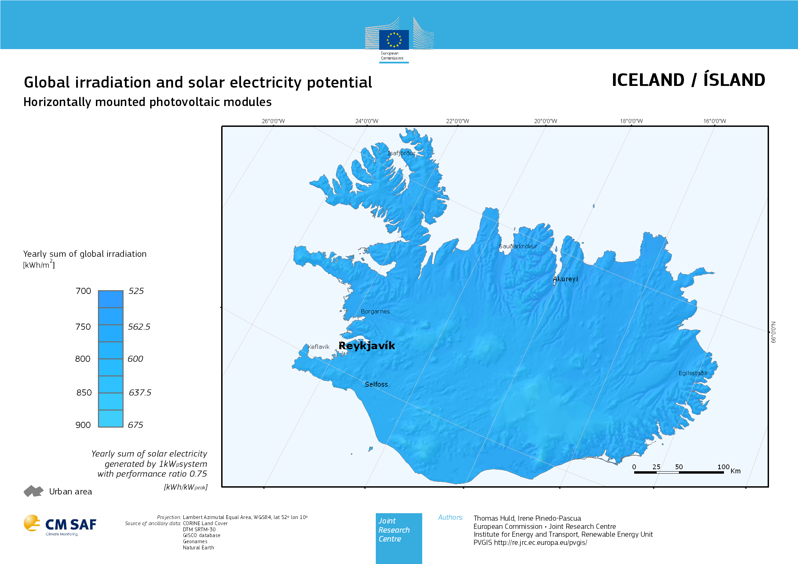
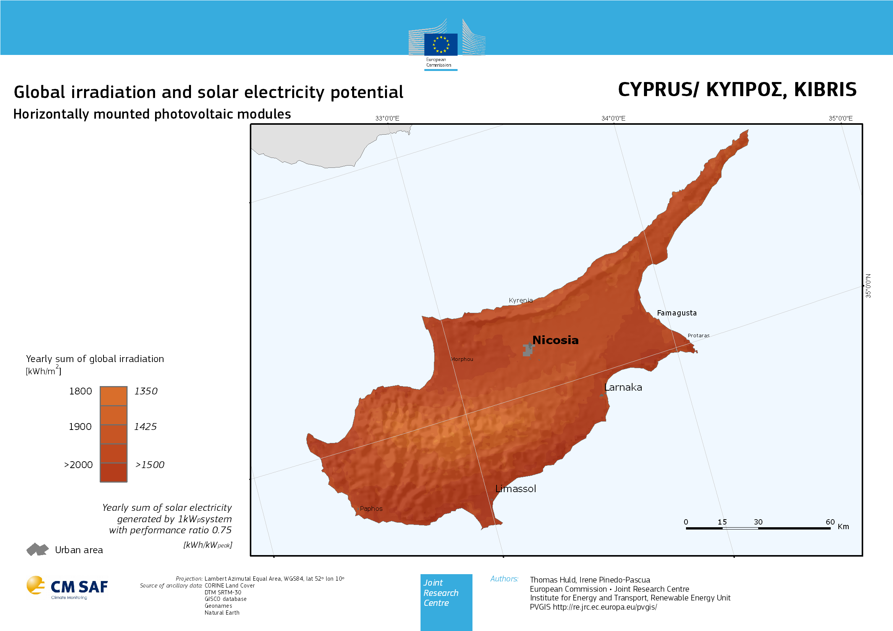

# Sprawozdanie z ćwiczenia nr 3: Czyste energie i ochrona środowiska

**Data wykonania:** 14.04.2026  
**Przedmiot:** Czyste energie i ochrona środowiska 2026  
**Ćwiczenie:** 3 – Portal PVGIS (Photovoltaic Geographical Information System) – źródło wiedzy oraz użyteczne narzędzia z zakresu energetyki słonecznej.  
**Autor:** Jan Rosa

## 1. Co to jest współczynnik PR i dlaczego nie wynosi 100%?

**Współczynnik wydajności PR** (*Performance Ratio*) to stosunek rzeczywistej rocznej produkcji energii systemu PV do produkcji teoretycznej wyznaczonej w warunkach laboratoryjnych STC (1000 W/m², 25°C), wyrażający ogólną efektywność instalacji — typowe wartości dla systemów sieciowych wynoszą **75–85%** [1]. PR nie osiąga 100%, ponieważ na rzeczywisty uzysk nakładają się straty: temperaturowe (sprawność ogniw maleje powyżej 25°C), odbiciowe przy małych kątach padania światła (2–4% rocznie), widmowe oraz systemowe związane z falownikiem, okablowaniem i niedopasowaniem modułów (domyślnie ~14% w PVGIS) [2]. Dodatkowym czynnikiem jest degradacja modułów wynosząca ok. 0,5% mocy rocznie, co oznacza, że po 20 latach instalacja pracuje przeciętnie z wydajnością ~95% wartości nominalnej [2]. Straty te są liczone multiplikatywnie — każda kolejna strata pomniejsza energię pozostałą po poprzedniej, więc łączny efekt jest mniejszy niż prosta suma strat składowych [2].

**Źródła:**
[1] PVGIS User Manual, Joint Research Centre, European Commission, https://joint-research-centre.ec.europa.eu/pvgis-photovoltaic-geographical-information-system/getting-started-pvgis/pvgis-user-manual_en
[2] PVGIS Data Sources & Calculation Methods, Joint Research Centre, European Commission, https://joint-research-centre.ec.europa.eu/pvgis-photovoltaic-geographical-information-system/getting-started-pvgis/pvgis-data-sources-calculation-methods_en

## 2. Na głównej mapie znajdź europejskie kraje o najmniejszym i największym potencjale pozyskiwania energii słonecznej i wymień je wraz z odpowiednią mapą w sprawozdaniu

**Najmniejszy potencjał — Islandia i Skandynawia**

Islandia osiąga najniższe wartości nasłonecznienia w Europie (GHI 700–900 kWh/m²/rok, dane z punktu 9), co wynika z wysokiej szerokości geograficznej (ok. 65°N) i częstego zachmurzenia. Podobnie niskie wartości odnotowują Norwegia (Oslo: 898 kWh/m²/rok), Finlandia (Helsinki: 938 kWh/m²/rok) i Szkocja (Edynburg: 889 kWh/m²/rok).

**Największy potencjał — Cypr i południowa Hiszpania**

Cypr osiąga najwyższe wartości nasłonecznienia w Europie (GHI 1800–2000 kWh/m²/rok, dane z punktu 9), a Nikozja notuje 1730 kWh/m²/rok (punkt 8). Zbliżone wartości mają południowa Hiszpania (Sewilla: 1803 kWh/m²/rok) oraz Grecja (Ateny: 1739 kWh/m²/rok).

## 3. Określ zakres optymalnych kątów pochylenia modułów fotowoltaicznych w Europie i wykaż od jakiego parametru lokalizacyjnego (długość czy szerokość geograficzna) jest zależny ten kąt

*Dane z API PVGIS endpoint `PVcalc` (pole `E_y` — roczny uzysk energii [kWh/kWp/rok]) dla 25 miast europejskich; dla każdej lokalizacji przeskanowano kąty pochylenia 0–80° co 2° i wybrano kąt maksymalizujący `E_y`.*

| Lokalizacja | Szerokość geogr. [°N] | Długość geogr. [°E] | Optymalny kąt [°] |
|:---|:---:|:---:|:---:|
| Cyprus | 34,9 | 33,0 | 30 |
| Malta | 35,9 | 14,5 | 32 |
| Crete | 35,3 | 25,1 | 28 |
| Athens | 37,9 | 23,7 | 34 |
| Lisbon | 38,7 | −9,1 | 34 |
| Seville | 37,4 | −5,9 | 34 |
| Madrid | 40,4 | −3,7 | 38 |
| Rome | 41,9 | 12,5 | 38 |
| Barcelona | 41,4 | 2,2 | 38 |
| Zagreb | 45,8 | 16,0 | 36 |
| Bern | 46,9 | 7,4 | 40 |
| Vienna | 48,2 | 16,4 | 38 |
| Paris | 48,8 | 2,3 | 38 |
| Prague | 50,1 | 14,4 | 38 |
| Warsaw | 52,2 | 21,0 | 40 |
| London | 51,5 | −0,1 | 40 |
| Berlin | 52,5 | 13,4 | 40 |
| Brussels | 50,8 | 4,4 | 40 |
| Copenhagen | 55,7 | 12,6 | 40 |
| Stockholm | 59,3 | 18,1 | 44 |
| Helsinki | 60,2 | 25,0 | 44 |
| Oslo | 59,9 | 10,7 | 44 |
| Riga | 56,9 | 24,1 | 42 |
| Reykjavik | 64,1 | −21,9 | 42 |
| Tromso | 69,7 | 19,0 | 48 |

**Zakres optymalnych kątów w Europie: 28° – 48°.** Wraz ze wzrostem szerokości geograficznej optymalny kąt pochylenia rośnie monotonicznie — od ok. 28–30° na południu (Cypr, Kreta) do 44–48° na północy (Skandynawia). Długość geograficzna nie wykazuje żadnego systematycznego wpływu: Lizbona (−9°E) i Ateny (24°E) leżące na tej samej szerokości mają identyczny optymalny kąt 34°. Kąt pochylenia jest zatem funkcją **szerokości geograficznej**.

## 4. Postaraj się określić przybliżoną relację matematyczną między parametrem znalezionym w poprzednim punkcie a optymalnym kątem pochylenia modułów fotowoltaicznych

*Dane z zadania 3; regresja liniowa `numpy.polyfit` stopnia 1 dopasowana do 25 par (szerokość geogr., optymalny kąt).*

$$\alpha_{\text{opt}} \approx 0{,}439 \cdot \varphi + 17{,}0$$

gdzie α_opt — optymalny kąt pochylenia [°], φ — szerokość geograficzna [°N].

Współczynnik determinacji wynosi **R² = 0,85** — wartość nieco obniżona przez ziarnistość skanowania co 2°, lecz rozrzut danych wokół prostej jest ogólnie niewielki. Zależność ma charakter fizyczny: im wyżej na północ, tym niżej kulminuje słońce nad horyzontem, więc moduł należy bardziej pochylić ku południu, aby prostopadle chwytać promieniowanie przez cały rok.

## 5. Jaki jest optymalny, całoroczny kąt pochylenia modułów fotowoltaicznych w Polsce?

*Dane z API PVGIS endpoint `PVcalc` (pole `E_y`) dla 8 głównych miast Polski; ta sama metoda skanowania kątów 0–80° co 2° jak w zadaniu 3.*

| Miasto | Szerokość geogr. [°N] | Optymalny kąt [°] |
|:---|:---:|:---:|
| Warszawa | 52,23 | 40 |
| Kraków | 50,06 | 40 |
| Gdańsk | 54,35 | 42 |
| Wrocław | 51,11 | 40 |
| Poznań | 52,41 | 40 |
| Białystok | 53,13 | 38 |
| Lublin | 51,25 | 38 |
| Rzeszów | 50,04 | 38 |

| Statystyka | Wartość |
|:---|:---:|
| Średnia | 39,5° |
| Minimum | 38° |
| Maksimum | 42° |
| Rozstęp | 4° |

Polska leży w wąskim przedziale szerokości geograficznych (50°–54°N), co przekłada się na bardzo jednorodny optymalny kąt pochylenia modułów — **ok. 38–42°, ze średnią 39,5°**. Różnica między skrajnymi miastami wynosi jedynie 4°, co w praktyce oznacza, że dla całego kraju można przyjąć jeden kąt montażowy ok. **40°**.

## 6. Jakiego przyrostu produkcji energii z systemu fotowoltaicznego można się spodziewać w Europie dzięki zastosowaniu jednoosiowego trackera?

*Dane z API PVGIS endpoint `seriescalc` (pole `P` — moc godzinowa [Wh]) dla 20 miast europejskich; zsumowany roczny uzysk porównano dla systemu stałego (`trackingtype=0`) i jednoosiowego trackera nachylonego pod optymalnym kątem (`trackingtype=4`, `optimalinclination=1`).*

| Lokalizacja | Szer. geogr. [°N] | E_y stały [Wh/rok] | E_y tracker [Wh/rok] | Przyrost [%] |
|:---|:---:|:---:|:---:|:---:|
| Norwegia/Oslo | 59,9 | 13 844 532 | 19 320 123 | 39,6 |
| Szwecja/Sztokholm | 59,3 | 14 785 609 | 20 194 876 | 36,6 |
| Finlandia/Helsinki | 60,2 | 14 693 393 | 20 052 962 | 36,5 |
| Wielka Brytania/Londyn | 51,5 | 15 894 819 | 20 469 011 | 28,8 |
| Irlandia/Dublin | 53,3 | 14 835 029 | 19 138 833 | 29,0 |
| Niemcy/Berlin | 52,5 | 16 399 212 | 21 080 309 | 28,5 |
| **Polska/Warszawa** | **52,2** | **16 387 989** | **20 825 266** | **27,1** |
| Francja/Paryż | 48,8 | 18 145 533 | 23 065 030 | 27,1 |
| Czechy/Praga | 50,1 | 17 218 120 | 21 860 111 | 27,0 |
| Austria/Wiedeń | 48,2 | 18 431 093 | 23 371 416 | 26,8 |
| Szwajcaria/Berno | 46,9 | 19 316 658 | 24 807 549 | 28,4 |
| Chorwacja/Zagrzeb | 45,8 | 19 566 773 | 24 328 727 | 24,3 |
| Włochy/Rzym | 41,9 | 23 702 238 | 30 191 924 | 27,4 |
| Hiszpania/Madryt | 40,4 | 25 762 201 | 33 075 089 | 28,4 |
| Hiszpania/Sewilla | 37,4 | 27 023 396 | 33 992 064 | 25,8 |
| Portugalia/Lizbona | 38,7 | 25 950 059 | 32 114 920 | 23,8 |
| Grecja/Ateny | 37,9 | 26 597 715 | 32 644 390 | 22,7 |
| Malta/Valletta | 35,9 | 27 523 849 | 33 327 268 | 21,1 |
| Cypr/Nikozja | 35,2 | 27 672 052 | 33 628 563 | 21,5 |
| Rumunia/Bukareszt | 44,4 | 20 816 173 | 25 804 562 | 24,0 |

**Zakres przyrostu w Europie: ok. 21–40%.** Użyty tracker nachylony (`trackingtype=4`, `optimalinclination=1`) obraca moduł wokół osi pochylonej pod optymalnym kątem dla danej szerokości geograficznej, śledząc ruch słońca po azymucie przez cały dzień. Największy przyrost odnotowano w **krajach skandynawskich** (Norwegia: 39,6%, Szwecja: 36,6%, Finlandia: 36,5%) — wynika to z tego, że na wysokich szerokościach geograficznych słońce latem opisuje bardzo szeroki łuk po niebie, a nachylona oś trackera pozwala optymalnie chwytać promieniowanie bezpośrednie przez cały długi dzień polarny. Na południu Europy słońce kulminuje wyżej, ale porusza się po węższym łuku, a udział promieniowania rozproszonego jest mniejszy — stąd niższe przyrosty względne (Cypr: 21,5%, Malta: 21,1%).

**Polska (Warszawa): przyrost ~27,1%** — wartość typowa dla środkowej Europy.

## 7. Porównaj dostępność energii słonecznej w polskich miastach z innymi miastami w pozostałych państwach europejskich

*Dane z API PVGIS endpoint `MRcalc` (pole `H(h)_m` — miesięczne sumy GHI [kWh/m²]) dla 6 miast polskich i 15 miast z innych krajów europejskich; wartości zsumowano do rocznych.*

| Miasto | Kraj | GHI [kWh/m²/rok] |
|:---|:---:|:---:|
| Warszawa | PL | 1059 |
| Kraków | PL | 1089 |
| Gdańsk | PL | 1043 |
| Wrocław | PL | 1090 |
| Poznań | PL | 1058 |
| Białystok | PL | 1026 |
| Oslo | NO | 898 |
| Helsinki | FI | 938 |
| Stockholm | SE | 944 |
| London | GB | 1022 |
| Edinburgh | GB | 889 |
| Berlin | DE | 1062 |
| Munich | DE | 1149 |
| Milan | IT | 1397 |
| Paris | FR | 1171 |
| Marseille | FR | 1594 |
| Madrid | ES | 1690 |
| Seville | ES | 1803 |
| Rome | IT | 1561 |
| Palermo | IT | 1664 |
| Athens | GR | 1739 |

| Grupa | Średnia [kWh/m²/rok] | Odch. std. | Min | Max |
|:---|:---:|:---:|:---:|:---:|
| Polska (6 miast) | 1061 | 23 | 1026 | 1090 |
| Reszta Europy (15 miast) | 1302 | 332 | 889 | 1803 |

Polska charakteryzuje się **bardzo jednorodną dostępnością energii słonecznej** — odchylenie standardowe wynosi jedynie 23 kWh/m²/rok, a rozstęp między najlepszym (Wrocław) i najgorszym (Białystok) miastem to tylko 64 kWh/m²/rok. Polska pod względem nasłonecznienia jest bardziej zbliżona do Niemiec i Wielkiej Brytanii niż do Francji czy krajów śródziemnomorskich. Kontrast z Włochami jest szczególnie wyraźny: różnica między Mediolanem (1397 kWh/m²/rok) a Palermo (1664 kWh/m²/rok) wynosi 267 kWh/m²/rok, podczas gdy rozstęp między wszystkimi polskimi miastami to jedynie 64 kWh/m²/rok.

## 8. Korzystając z darmowych map na komercyjnym portalu SolarGIS porównaj dostępność energii słonecznej w Europie i na innych kontynentach

*Dane z API PVGIS endpoint `MRcalc` (pole `H(h)_m` — miesięczne GHI) dla 48 lokalizacji reprezentatywnych dla 5 kontynentów; wartości zsumowano do rocznych i pogrupowano statystycznie.*

| Lokalizacja | Kontynent | GHI [kWh/m²/rok] |
|:---|:---|:---:|
| Reykjavik (IS) | Europa | 707 |
| Oslo (NO) | Europa | 898 |
| Helsinki (FI) | Europa | 938 |
| Stockholm (SE) | Europa | 944 |
| Warsaw (PL) | Europa | 1059 |
| London (GB) | Europa | 1022 |
| Berlin (DE) | Europa | 1062 |
| Prague (CZ) | Europa | 1114 |
| Vienna (AT) | Europa | 1192 |
| Madrid (ES) | Europa | 1690 |
| Seville (ES) | Europa | 1803 |
| Lisbon (PT) | Europa | 1670 |
| Rome (IT) | Europa | 1561 |
| Athens (GR) | Europa | 1739 |
| Palermo (IT) | Europa | 1664 |
| Phoenix (US) | Ameryka | 2038 |
| Las Vegas (US) | Ameryka | 2021 |
| Miami (US) | Ameryka | 1763 |
| New York (US) | Ameryka | 1427 |
| Mexico City (MX) | Ameryka | 1999 |
| Santiago (CL) | Ameryka | 2004 |
| Lima (PE) | Ameryka | 2100 |
| Sao Paulo (BR) | Ameryka | 1560 |
| Manaus (BR) | Ameryka | 1687 |
| Buenos Aires (AR) | Ameryka | 1623 |
| Cairo (EG) | Afryka | 2081 |
| Marrakesh (MA) | Afryka | 1974 |
| Tripoli (LY) | Afryka | 1865 |
| Nairobi (KE) | Afryka | 1867 |
| Lagos (NG) | Afryka | 1792 |
| Kinshasa (CD) | Afryka | 1725 |
| Cape Town (ZA) | Afryka | 1809 |
| Johannesburg (ZA) | Afryka | 1909 |
| Riyadh (SA) | Azja | 2140 |
| Dubai (AE) | Azja | 2034 |
| Tehran (IR) | Azja | 1788 |
| New Delhi (IN) | Azja | 1810 |
| Mumbai (IN) | Azja | 1776 |
| Colombo (LK) | Azja | 1765 |
| Beijing (CN) | Azja | 1507 |
| Shanghai (CN) | Azja | 1432 |
| Tokyo (JP) | Azja | 1321 |
| Singapore (SG) | Azja | 1720 |
| Bangkok (TH) | Azja | 1782 |
| Jakarta (ID) | Azja | 1862 |
| Perth (AU) | Australia/Oceania | 1872 |
| Sydney (AU) | Australia/Oceania | 1637 |
| Melbourne (AU) | Australia/Oceania | 1533 |

### Podsumowanie statystyczne

| Kontynent | N | Średnia [kWh/m²/rok] | Min | Max | σ | Rozstęp |
|:---|:---:|:---:|:---:|:---:|:---:|:---:|
| Europa | 15 | 1271 | 707 | 1803 | 359 | 1096 |
| Ameryka | 10 | 1822 | 1427 | 2100 | 205 | 673 |
| Afryka | 8 | 1878 | 1725 | 2081 | 104 | 356 |
| Azja | 12 | 1745 | 1321 | 2140 | 223 | 819 |
| Australia/Oceania | 3 | 1681 | 1533 | 1872 | 142 | 339 |
| **Świat** | **48** | **1611** | **707** | **2140** | **371** | **1433** |

Europa wyróżnia się **najniższą średnią** (1271 kWh/m²/rok) i **największą wewnętrzną zmiennością** (σ = 359), co wynika z dużego zakresu szerokości geograficznych — od Islandii po basen Morza Śródziemnego. Najlepsze warunki słoneczne oferują **Afryka** (średnia 1878 kWh/m²/rok, bardzo mała zmienność σ = 104) oraz **Bliski Wschód i Arabia** (Rijad: 2140 kWh/m²/rok — najwyższa wartość w zbiorze). Ameryka Północna (szczególnie pustynny południowy zachód USA) plasuje się na poziomie porównywalnym z Afryką (średnia 1822 vs 1878 kWh/m²/rok); Australia jest nieznacznie poniżej (średnia 1681 kWh/m²/rok). Polska (1059 kWh/m²/rok) osiąga ok. **50% potencjału** najlepszych lokalizacji na świecie.

## 9. Wypełnij tabelę danymi z map wskazanych krajów

| Kraj | GHI Min [kWh/m²/rok] | GHI Max [kWh/m²/rok] | Produkcja Min [kWh/kWp/rok] | Produkcja Max [kWh/kWp/rok] | Uwagi |
|:---|:---:|:---:|:---:|:---:|:---|
| Islandia | 700 | 900 | 500 | 800 | Warunki są bardzo jednolite w całym kraju, a Islandia notuje najniższe nasłonecznienie w Europie ze względu na wysoką szerokość geograficzną i częste zachmurzenie. |
| Cypr | 1800 | 2000 | 1900 | 2100 | Warunki są jednolite w całym kraju, a Cypr osiąga najwyższe nasłonecznienie w Europie dzięki śródziemnomorskiemu klimatowi i niskiej szerokości geograficznej. |
| Niemcy | 1000 | 1200 | 800 | 1050 | Południe kraju (Bawaria, Badenia-Wirtembergia) ma wyraźnie lepsze warunki niż północ, natomiast obszary centralne wykazują najniższe wartości nasłonecznienia. |
| Hiszpania | 1200 | 2000 | 900 | 1600 | Południe i centrum (szczególnie Andaluzja i Kastylia-La Mancha) oferują najlepsze warunki nasłonecznienia w Europie Zachodniej, zbliżone do poziomu Afryki Północnej. |
| Czechy | 1000 | 1200 | 825 | 1000 | Warunki są stosunkowo jednolite w całym kraju, z niewielką zmiennością regionalną wynikającą z urozmaiconej rzeźby terenu. |
| Francja | 1000 | 1600 | 900 | 1500 | Warunki regionalne są silnie zróżnicowane — południe, szczególnie okolice Marsylii i Lazurowego Wybrzeża, osiąga wartości zbliżone do Hiszpanii, podczas gdy północ przypomina Belgię. |
| Niderlandy | 1000 | 1200 | 800 | 1000 | Warunki są bardzo jednolite w całym kraju ze względu na płaskie ukształtowanie terenu i niewielki zasięg geograficzny państwa. |
| Włochy | 1200 | 1800 | 600 | 1700 | Kraj wykazuje największy wewnętrzny rozstęp wartości spośród analizowanych krajów — południe, Sycylia i Sardynia osiągają wartości ponad dwukrotnie wyższe niż uprzemysłowiona północ (okolice Mediolanu). |
| Wielka Brytania | 800 | 1200 | 600 | 1050 | Południe kraju, szczególnie okolice Londynu i Kornwalii, ma wyraźnie lepsze warunki niż chłodniejsza i bardziej zachmurzona Szkocja na północy. |
| Polska | 1000 | 1150 | 850 | 1000 | Warunki są bardzo jednolite w skali całego kraju, a jedyne lokalne minima nasłonecznienia występują na terenach górskich (Tatry, Sudety) ze względu na zwiększone zachmurzenie orograficzne. |

## 10. Spróbuj wyjaśnić, dlaczego te same stawki taryf gwarantowanych w Niemczech stymulowały równomierny rozwój branży a w Hiszpanii doprowadziły do lawinowego wzrostu budowy farm PV i niemal spowodowały krach na rynku energii

**Feed-In Tariff (FiT)** to system gwarantowanego odkupu energii z OZE po stałej, z góry ustalonej cenie przez 20–25 lat, niezależnie od ceny rynkowej. Różnicę między stawką FiT a ceną rynkową pokrywają **wszyscy odbiorcy energii elektrycznej** poprzez dodatkową opłatę w rachunku (Niemcy: *EEG-Umlage*). W przypadku braku pełnego przeniesienia tych kosztów na odbiorców różnicę pokrywa budżet państwa, co prowadzi do narastania długu publicznego.

| Parametr | Niemcy (2006) | Hiszpania (2007–2008) |
|:---|:---|:---|
| FiT dla PV | ~0,51 €/kWh | ~0,44 €/kWh |
| Cena detaliczna energii | ~0,19 €/kWh | ~0,11 €/kWh |
| Relacja FiT / cena rynkowa | ~2,5× | ~4× |
| Nasłonecznienie | ~1 000 kWh/kWp/rok | ~1 600 kWh/kWp/rok |
| Roczna degresja stawek | ~5% | brak |
| Limit rocznych instalacji | brak (degresja jako hamulec) | brak |
| Finansowanie dopłat | EEG-Umlage (odbiorcy) | deficyt taryfowy (dług państwa) |

W Niemczech mechanizm **automatycznej degresji** (~5% rocznie) — im więcej instalacji, tym niższe stawki dla kolejnych — tworzył naturalny hamulec wzrostu i utrzymywał rentowność inwestycji na umiarkowanym poziomie [2]. W Hiszpanii brak degresji i brak limitu mocy, w połączeniu z dwukrotnie wyższym nasłonecznieniem, spowodowały, że rentowność inwestycji PV była wyjątkowo wysoka i atrakcyjna spekulacyjnie. W 2008 r. zainstalowano **2 708 MW** (limit przewidziany dekretem: ~371 MW), co wygenerowało wieloletnie zobowiązania finansowe państwa [2]. Deficyt taryfowy (*déficit tarifario*) przekroczył na koniec 2012 r. **29 mld €** (~3% PKB Hiszpanii), zmuszając rząd do retroaktywnego obcięcia stawek w 2013 r. (RDL 2/2013) i wywołując falę procesów arbitrażowych [1].

Zasadnicza różnica między oboma krajami leżała nie w wysokości samej taryfy, lecz w **konstrukcji systemu**: brak mechanizmu korekty i lepsze warunki słoneczne przekształciły instrument wsparcia OZE w narzędzie spekulacji inwestycyjnej.

## Podsumowanie

Ćwiczenie pokazało, że efektywność systemów fotowoltaicznych jest silnie zdeterminowana przez położenie geograficzne — przede wszystkim przez szerokość geograficzną. Optymalny kąt pochylenia modułów rośnie monotonicznie z szerokością geograficzną według relacji α ≈ 0,44·φ + 17° (R² = 0,85); dla Polski wynosi ok. 40° i jest wyjątkowo jednorodny w skali całego kraju. Polska osiąga nasłonecznienie rzędu 1026–1090 kWh/m²/rok — porównywalne z Niemcami i Wielką Brytanią, lecz dwukrotnie niższe niż najlepsze lokalizacje świata (Arabia Saudyjska, Sahara ~2100–2140 kWh/m²/rok). Zastosowanie jednoosiowego trackera nachylonego pod optymalnym kątem zwiększa roczny uzysk energii w Europie o 21–40%, przy czym największy zysk odnotowują kraje skandynawskie (ok. 37–40%) ze względu na szeroki łuk słońca latem; dla Polski przyrost wynosi ~27%. Analiza polityki taryf gwarantowanych wykazała, że ten sam instrument FiT dał stabilny rozwój rynku w Niemczech (mechanizm degresji) i doprowadził do kryzysu w Hiszpanii (brak degresji + dwukrotnie wyższe nasłonecznienie), co potwierdza konieczność kalibrowania stawek do lokalnych zasobów słonecznych.

**Źródła:**
[1] Johannesson Linden A., Kalantzis F., Maincent E., Pienkowski J., *Electricity Tariff Deficit: Temporary or Permanent Problem in the EU?*, European Economy — Economic Papers No. 534, European Commission DG ECFIN, October 2014. https://ec.europa.eu/economy_finance/publications/economic_paper/2014/pdf/ecp534_en.pdf
[2] Winkler J., Ragwitz M., *Solar Energy Policy in the EU and the Member States, from the Perspective of the Petitions Received*, Study PE 556.968, European Parliament — Policy Department C, Fraunhofer ISI, 2016. https://www.europarl.europa.eu/RegData/etudes/STUD/2016/556968/IPOL_STU(2016)556968_EN.pdf
