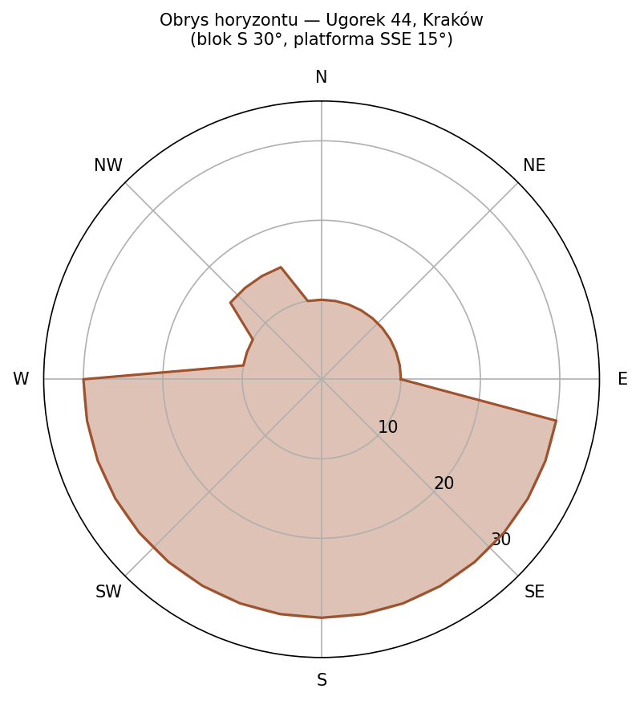

# Sprawozdanie z ćwiczenia nr 4: Czyste energie i ochrona środowiska

**Data wykonania:** 05.05.2026  
**Przedmiot:** Czyste energie i ochrona środowiska 2026  
**Ćwiczenie:** 4 – Portal PVGIS (Photovoltaic Geographical Information System) – źródło wiedzy oraz użyteczne narzędzia z zakresu energetyki słonecznej.  
**Autor:** Jan Rosa

---

## 1. Porównanie baz danych nasłonecznienia dostępnych w PVGIS

> Porównaj (w postaci zestawienia tabelarycznego) dostępne na portalu PVGIS bazy danych o nasłonecznieniu pod względem rejonów geograficznych, które obejmują, źródła danych (pomiary naziemne, satelita), rozmiaru elementarnego obszaru, dla którego te dane wyznaczono, zakresu czasowego dostępności danych oraz preferencji stosowania (wskazania autorów portalu).

### Bazy danych PVGIS (irradiacja – zestawienie)

| Dataset                    | Typ danych           | Obszar geograficzny                              | Rozdzielczość        | Zakres czasowy | Źródło bazowe   | Status / preferencja PVGIS                                     |
| -------------------------- | -------------------- | ------------------------------------------------ | -------------------- | -------------- | --------------- | -------------------------------------------------------------- |
| **PVGIS-SARAH3**           | satelitarne          | Europa, Afryka, Bliski Wschód, części Azji       | ~0.05° (~5 km)       | 2005–2023      | Meteosat CM SAF | **domyślna (tam gdzie dostępna)**       |
| **PVGIS-SARAH2**           | satelitarne          | Europa, Afryka, Azja, Ameryka Płd. (ograniczona) | ~0.05° (~5 km)       | 2005–2020      | Meteosat CM SAF | zastępowana przez SARAH3                |
| **PVGIS-NSRDB**            | satelitarno-modelowe | Ameryka Północna i Południowa                    | ~0.038–0.04° (~4 km) | 2005–2015      | NREL NSRDB      | preferowana dla Ameryk                  |
| **PVGIS-ERA5 / ERA5-Land** | reanaliza            | globalny zasięg                                  | ~0.25° (~25 km)      | 2005–2023      | ECMWF ERA5      | fallback (brak satelitów)               |
| **PVGIS-SARAH (legacy)**   | satelitarne          | Europa, Afryka                                   | ~0.05°               | 2005–2016      | CM SAF          | wycofana                                                       |

Portal stosuje satelitarne bazy SARAH3/NSRDB tam gdzie to możliwe; ERA5 jedynie jako fallback globalny (rozdzielczość ~25 km, 5× gorsza od SARAH). Źródło: [JRC PVGIS 5.3](https://joint-research-centre.ec.europa.eu/photovoltaic-geographical-information-system-pvgis/pvgis-releases/pvgis-53_en).

Dla zastosowań na terenie Polski zalecana jest PVGIS-SARAH3 — domyślna, o najwyższej rozdzielczości i najdłuższym pokryciu czasowym spośród dostępnych baz europejskich.

---

## 2. Miesięczne nasłonecznienie dla miejsca zamieszkania

> Pobierz w formie raportów pdf dane o miesięcznym nasłonecznieniu dla miejsca Twojego zamieszkania i zamieść w sprawozdaniu. Najlepiej do tego celu wykorzystać plik TMY.

Dane pobrano z **PVGIS-SARAH3** dla Prądnik Czerwony, Kraków (rok 2022).

### Miesięczne sumy promieniowania

| Miesiąc | H(h) [kWh/m²] | H(i_opt) [kWh/m²] | H(i=40°) [kWh/m²] | Gb(n) [kWh/m²] | Kd [-] |
|---------|:-------------:|:-----------------:|:-----------------:|:--------------:|:------:|
| Sty | 26,6 | 50,4 | 50,8 | 42,6 | 0,63 |
| Lut | 49,8 | 81,4 | 81,8 | 70,0 | 0,53 |
| Mar | 115,7 | 168,7 | 169,2 | 161,1 | 0,34 |
| Kwi | 105,4 | 114,1 | 113,9 | 75,9 | 0,61 |
| Maj | 176,3 | 179,8 | 179,3 | 158,1 | 0,44 |
| Cze | 189,0 | 185,3 | 184,6 | 177,6 | 0,37 |
| Lip | 173,2 | 173,0 | 172,4 | 147,2 | 0,44 |
| Sie | 144,8 | 157,1 | 156,8 | 124,5 | 0,48 |
| Wrz | 91,5 | 107,2 | 107,2 | 70,4 | 0,60 |
| Paź | 74,6 | 120,6 | 121,2 | 107,2 | 0,45 |
| Lis | 31,2 | 52,6 | 52,8 | 40,4 | 0,62 |
| Gru | 19,2 | 33,5 | 33,7 | 24,5 | 0,73 |
| **Rok** | **1197,4** | **1423,7** | **1423,5** | **1199,4** | — |

*H(h) — irradiancja horyzontalna; H(i_opt) — irradiancja pod kątem optymalnym (38°); H(i=40°) — irradiancja pod wybranym kątem; Gb(n) — promieniowanie bezpośrednie normalne; Kd — wskaźnik rozproszenia. Źródło: PVGIS-SARAH3.*

Maksymalna irradiancja horyzontalna wyniosła w czerwcu 189,0 kWh/m², minimalna w grudniu 19,2 kWh/m² — stosunek 10:1. Optymalny kąt nachylenia to **38°** (wybrano 40° — zaokrąglenie nieznacznie faworyzuje zimę). Przy nachyleniu optymalnym uzysk w styczniu jest o 89% wyższy niż na płaszczyźnie poziomej.

$ oraz $H(i\_opt)$.")

W zimie dominuje promieniowanie rozproszone (Kd > 0,6 w grudniu i listopadzie). Najczyściejsze niebo w 2022 roku notował marzec (Kd = 0,34).


.")

Roczna suma GHI wynosi 1197,4 kWh/m², przy wyraźnej asymetrii sezonowej — zimą promieniowanie jest 10-krotnie niższe niż latem.

---

## 3. Wybór optymalnej bazy pogodowej dla warunków Polski

> Na podstawie informacji umieszczonych na portalu zasugeruj, która baza pogodowa w przypadku naszego kraju będzie najbardziej odpowiednia do przeprowadzenia symulacji pracy systemów fotowoltaicznych.

Dla warunków Polski najbardziej odpowiednią bazą danych w PVGIS jest **PVGIS-SARAH3**.

PVGIS-SARAH3 obejmuje Europę, dostarcza dane satelitarne o rozdzielczości ~5 km (5× lepsza od ERA5) i pokrywa lata 2005–2023 (dłużej niż SARAH2).

---

## 4. Analiza dziennej dostępności promieniowania słonecznego dla różnych układów pracy

> Dla swojego miejsca zamieszkania, wykorzystując bazę danych pogodowych wskazaną w pkt.3 przeanalizuj dzienną dostępność promieniowania słonecznego na płaszczyźnie skierowanej na południe i pochylonej pod kątem 35° oraz na płaszczyźnie śledzącej pozycję Słońca. W sprawozdaniu umieść odpowiednie wykresy dla następujących miesięcy: czerwiec, wrzesień i grudzień.

Porównano dwa układy: **stacjonarny** (35°, azymut 0°) i **nadążny 2-osiowy**, na podstawie danych PVGIS-SARAH3.


| Miesiąc | H(35°) [kWh/d] | H(2-oś) [kWh/d] | Zysk śledzenia |
|---------|:--------------:|:---------------:|:--------------:|
| Czerwiec | 4,23 | 4,66 | +10,0% |
| Wrzesień | 3,86 | 3,94 | +1,9% |
| Grudzień | 1,09 | 1,30 | +19,6% |

Zysk z śledzenia jest największy w grudniu (+19,6%) — Słońce jest nisko (~17°), więc panel stacjonarny ma duże odchylenie kątowe od kierunku na Słońce. We wrześniu elewacja południa (~37°) jest bliska kątowi nachylenia panelu i zysk spada do +1,9%. W czerwcu zysk całodzienny wynosi +10,0%, choć w południe tylko +1,4% — śledzenie opłaca się głównie w godzinach rannych i wieczornych.

Śledzenie dwuosiowe daje największy przyrost zimą; latem korzyść jest ograniczona przez wysokie Słońce i dużą składową rozproszoną.

---

## 5. Wpływ zachmurzenia na promieniowanie w okolicach południa słonecznego

> Na podstawie analizy z pkt 4 określ w procentach ile całkowitego promieniowania słonecznego pochłaniają chmury w okolicach południa słonecznego (wtedy gdy wartość promieniowania słonecznego jest największa). Porównania dokonaj dla trzech wymienionych wyżej miesięcy.

Wskaźnik rozproszenia Kd = Gd(i)/G(i) obliczono z danych godzinowych dla przedziału 11:00–13:00.

| Miesiąc | G(35°) południe [W/m²] | Kd [-] | Charakter nieba |
|---------|:---------------------:|:------:|:---------------:|
| Czerwiec | 575 | 0,615 | zachmurzone (Kd > 0,5) |
| Wrzesień | 612 | 0,459 | mieszane (0,3 < Kd ≤ 0,5) |
| Grudzień | 178 | 0,718 | silnie rozproszone (Kd > 0,5) |

Grudzień ma najwyższy Kd (0,718) — promieniowanie jest prawie całkowicie rozproszone. Wrzesień jest najbardziej klarowny (Kd = 0,459). Czerwiec osiąga Kd = 0,615 pomimo długiego dnia — letnie zachmurzenie konwekcyjne skutecznie rozprasza promieniowanie.

W Krakowie promieniowanie południa jest wyraźnie rozproszone przez większą część roku; wyjątkiem są marzec i wrzesień.

---

## 6. Efektywność śledzenia pozycji Słońca względem układu stacjonarnego

> Na podstawie analizy z pkt 4 określ w jakich miesiącach w okolicy południa słonecznego zastosowanie śledzenia pozycji Słońca najbardziej zwiększa ilość dostępnego promieniowania słonecznego względem stacjonarnego układu pochylonego pod całorocznym kątem optymalnym (35°)?

| Miesiąc | Zysk układu 2-osiowego vs 35° w okolicach południa |
|---------|:--------------------------------------------------:|
| Czerwiec | +1,4% |
| Wrzesień | +1,9% |
| Grudzień | +22,0% |

W południe zysk z śledzenia jest **największy w grudniu** (+22%). Przy elewacji Słońca ~17° kąt padania na panel 35° wynosi θ = (90° − 35°) − 17° = **38°**, podczas gdy układ 2-osiowy zawsze trzyma θ = 0°. Latem Słońce jest wysoko (~63°) i panel 35° jest do niego dobrze ustawiony — zysk w południe to tylko 1,4%, ale godziny poranne i wieczorne dają dodatkowe 9% (całodniowy zysk w czerwcu: +10,0%).

Śledzenie pozycji Słońca najbardziej opłaca się zimą, gdy kąt padania na panel stacjonarny jest duży.

---

## 7. Analiza godzinowych danych promieniowania słonecznego

> Dla swojego miejsca zamieszkania, dla bazy danych wybranej w pkt 3 zaimportuj godzinowy plik (w formacie csv) promieniowania słonecznego wraz z jego składowymi w płaszczyźnie horyzontalnej dla ostatniego roku, który jest dostępny w tej bazie. Fragment pliku wraz z nagłówkami kolumn umieść w sprawozdaniu.

Dane godzinowe PVGIS-SARAH3 dla płaszczyzny poziomej, rok 2023. Suma roczna GHI = **1140,7 kWh/m²**.

 oraz średnie dobowe profile GHI dla wybranych miesięcy — Kraków 2023.")

| Kolumna | Opis |
|---------|------|
| `time` | Czas UTC (format YYYYMMDD:HHmm) |
| `Gb(i)` | Promieniowanie bezpośrednie na płaszczyźnie poziomej [W/m²] |
| `Gd(i)` | Promieniowanie rozproszone poziome DHI [W/m²] |
| `Gr(i)` | Promieniowanie odbite od podłoża [W/m²] (≈ 0 dla kąta 0°) |
| `H_sun` | Wysokość Słońca nad horyzontem [°] |
| `T2m` | Temperatura powietrza na wys. 2 m [°C] |
| `WS10m` | Prędkość wiatru na wys. 10 m [m/s] |
| `Int` | Flaga rekonstrukcji (1 = dane interpolowane) |

Fragment danych (pierwsze 5 rekordów godzinowych, 1 stycznia 2023):

```
time,Gb(i),Gd(i),Gr(i),H_sun,T2m,WS10m,Int
20230101:0010,0.0,0.0,0.0,0.0,11.93,4.21,0.0
20230101:0110,0.0,0.0,0.0,0.0,12.11,4.07,0.0
20230101:0210,0.0,0.0,0.0,0.0,12.23,4.07,0.0
20230101:0310,0.0,0.0,0.0,0.0,12.23,4.07,0.0
20230101:0410,0.0,0.0,0.0,0.0,12.05,4.0,0.0
```

Dane za rok 2023 obejmują 8760 rekordów godzinowych.

---

## 8. Charakterystyka sposobów śledzenia Słońca (Vertical axis, Inclined axis, Two axis)

> Własnymi słowami opisz na czym polegają następujące sposoby śledzenia Słońca i jakie parametry należy w nich ustawić: Vertical axis, Inclined axis, Two axis?

### Vertical axis (śledzenie azymutu — oś pionowa)

Panel obraca się wokół pionowej osi — śledzi zmianę azymutu Słońca w ciągu dnia (wschód → południe → zachód). Kąt nachylenia względem poziomu jest stały i ustawiany raz — PVGIS może dobrać go automatycznie. System działa dobrze latem, gdy Słońce przemieszcza się po szerokim łuku. Zimą, przy niskim Słońcu, efektywność tego układu spada poniżej systemu stacjonarnego.

### Inclined axis (śledzenie elewacji — oś pozioma N–S)

Panel obraca się wokół poziomej osi N–S, śledząc zmianę elewacji Słońca w ciągu dnia (wschód nisko → południe wysoko → zachód nisko). Azymut pozostaje stały. W południe — gdy większość promieniowania zimowego dociera do panelu — oś wymusza orientację zbliżoną do poziomej, co ogranicza uzysk. PVGIS dobiera kąt nachylenia osi automatycznie.

### Two axis (śledzenie pełne — dwie osie)

Panel obraca się równocześnie wokół dwóch osi — pionowej i poziomej — zawsze wskazując prostopadle na Słońce. Daje najwyższy możliwy uzysk przez cały rok. Brak parametrów kątowych do ustawienia — obie osie sterowane automatycznie. Jest to też mechanicznie najbardziej złożony i kosztowny układ.

*Źródło: PVGIS User Manual v5.3.*

Spośród trzech systemów two-axis daje najwyższy roczny uzysk, vertical axis jest skuteczny latem dzięki azymutalnej korekcie, inclined axis N-S przynosi umiarkowany zysk roczny z gorszymi wynikami zimowymi.

---

## 9. Metodyka tworzenia plików TMY (Typical Meteorological Year)

> Wyjaśnij jak tworzone są pliki TMY?

TMY (Typowy Rok Meteorologiczny) to **syntetyczny plik godzinowy** sklejony z 12 miesięcy, z których każdy pochodzi z innego roku historycznego. Nie odpowiada żadnemu rzeczywistemu rokowi — reprezentuje przeciętne warunki meteorologiczne dla danej lokalizacji. Dla PVGIS-SARAH3 podstawą jest 19 lat danych (2005–2023).

Procedura opiera się na **metodzie Finkelstein-Schafer**: dla każdego miesiąca PVGIS porównuje dystrybuantę (CDF) wybranych zmiennych (GHI, DNI, temperatura) z każdego dostępnego roku z dystrybuantą długookresową. Miesiąc o najmniejszej statystyce FS — najlepiej odwzorowujący wieloletnią normę — zostaje wybrany jako reprezentatywny. Wybrane 12 miesięcy sklejane są w 8760 rekordów godzinowych.

*Źródło: PVGIS User Manual v5.3.*

TMY nie odpowiada żadnemu rzeczywistemu rokowi, ale dobrze reprezentuje typowe warunki do projektowania systemów PV.

---

## 10. Zawartość i rozdzielczość czasowa plików TMY w PVGIS

> Wymień dane umieszczone w plikach TMY na portalu PVGIS oraz określ rozdzielczość czasową tych plików (jaki zakres czasu przypisany jest pojedynczemu rekordowi).

Rozdzielczość czasowa: 1 godzina (8760 rekordów na rok).

Plik zawiera nagłówek metadanych (współrzędne, wysokość, przesunięcie czasu nasłonecznienia) i tabelę z informacją, z którego roku pochodzi każdy miesiąc. Po nagłówku następują dane godzinowe:

| Kolumna | Opis | Jednostka |
|---------|------|-----------|
| `time(UTC)` | Czas w strefie UTC (format YYYYMMDD:HHmm) | — |
| `T2m` | Temperatura powietrza na wys. 2 m | °C |
| `RH` | Wilgotność względna | % |
| `G(h)` | Globalne promieniowanie poziome GHI | W/m² |
| `Gb(n)` | Promieniowanie bezpośrednie normalne DNI | W/m² |
| `Gd(h)` | Promieniowanie rozproszone poziome DHI | W/m² |
| `IR(h)` | Promieniowanie długofalowe (podczerwone) poziome | W/m² |
| `WS10m` | Prędkość wiatru na wys. 10 m | m/s |
| `WD10m` | Kierunek wiatru | ° |
| `SP` | Ciśnienie atmosferyczne przy powierzchni | Pa |

Plik TMY zawiera 10 zmiennych meteorologicznych w rozdzielczości godzinowej.

---

## 11. Analiza formatów plików TMY dla wybranej lokalizacji

> Pobierz z portalu PVGIS oba pliki TMY właściwe dla Twojego miejsca zamieszkania. Pliki pobierz we wszystkich możliwych formatach a następnie je oglądnij. Początku fragment dowolnego z tych plików (z nagłówkami kolumn) umieść w sprawozdaniu.

Pobrano pliki TMY dla Krakowa (PVGIS-SARAH3, 2005–2023) w formatach: **CSV**, **JSON**, **EPW** (EnergyPlus Weather) oraz **basic CSV**.

 oraz mapa ciepła średniego godzinowego GHI w cyklu dobowo-rocznym (prawy panel).")

Tabela miesięcy i lat źródłowych z nagłówka TMY:

| Miesiąc | Rok źródłowy |
|---------|:------------:|
| Styczeń | 2005 |
| Luty | 2014 |
| Marzec | 2010 |
| Kwiecień | 2006 |
| Maj | 2010 |
| Czerwiec | 2021 |
| Lipiec | 2022 |
| Sierpień | 2020 |
| Wrzesień | 2014 |
| Październik | 2008 |
| Listopad | 2020 |
| Grudzień | 2008 |

Format EPW służy do symulacji budynkowych (EnergyPlus), CSV i JSON — do symulacji PV. Miesiące TMY dla Krakowa pochodzą z lat 2005–2022 (PVGIS-SARAH3).

---

## 12. Produkcja energii przez system o mocy 1 kWp: montaż wolnostojący vs BIPV

> W miejscu swojego zamieszkania zlokalizuj stacjonarny system fotowoltaiczny o mocy 1 kWp ustawiony pod optymalnymi kątami azymutu i elewacji (wyliczenia dokonane przez portal). Korzystając z bazy PVGIS-SARAH3 sprawdź jaką ilość energii będzie on rocznie produkował w przypadku montażu wolnostojącego a jaką w przypadku integracji z budynkiem. Wartości końcowe przedstaw w sprawozdaniu określając procentowy spadek produkcji dla systemu zintegrowanego z budynkiem. Spróbuj wyjaśnić co jest przyczyną tego spadku produkcji energii elektrycznej? Jako że mieszkam w bloku to analizowany jest system zamontowany pionowo na elewacji bloku.

Lokalizacja: Kraków | Baza: PVGIS-SARAH3 | Moc: 1 kWp | Straty systemowe: 14%

| Wariant montażu | Kąt nachylenia | Azymut | E_y [kWh/kWp] |
|-----------------|:--------------:|:------:|:-------------:|
| Wolnostojący (optymalny) | 39° | −1° | **1085,0** |
| BIPV (fasada południowa) | 90° | 0° | **775,5** |
| **Spadek produkcji BIPV** | | | **−28,5%** |

| Miesiąc | Wolnostojący [kWh] | BIPV 90° [kWh] | Różnica [%]* |
|---------|:-----------------:|:---------------:|:-----------:|
| Sty | 44,6 | 47,2 | **−5,7%** |
| Lut | 57,8 | 54,0 | +6,6% |
| Mar | 97,0 | 78,2 | +19,4% |
| Kwi | 115,4 | 76,4 | +33,8% |
| Maj | 121,6 | 67,7 | +44,3% |
| Cze | 124,7 | 63,9 | +48,8% |
| Lip | 129,9 | 68,7 | +47,1% |
| Sie | 123,0 | 75,9 | +38,3% |
| Wrz | 103,0 | 77,9 | +24,4% |
| Paź | 81,8 | 74,6 | +8,9% |
| Lis | 46,6 | 47,3 | **−1,5%** |
| Gru | 39,6 | 43,7 | **−10,3%** |

*Różnica = (Wolnostojący − BIPV) / Wolnostojący × 100%; wartości ujemne (bold) oznaczają miesiące, gdy BIPV produkuje więcej.*

Pionowe zamontowanie modułów (β = 90°) powoduje duże kąty padania promieniowania przez większość roku. W czerwcu przy elewacji Słońca ~63° kąt padania na fasadę wynosi 63°, a cos(63°) ≈ 0,45 — panel pochłania mniej niż połowę promieniowania bezpośredniego. Zimą proporcje się odwracają: przy elewacji ~17° kąt padania na fasadę wynosi θ = 90° − 17° = **73°**, podczas gdy na panelu 39° kąt ten to θ = (90° − 39°) − 17° = **34°**. Panel stacjonarny jest też geometrycznie bliżej optimum zimowego, więc fasada BIPV przewyższa go w grudniu tylko dzięki niskiej pozycji Słońca na niebie, nie z powodu lepszego kąta.

BIPV na fasadzie południowej produkuje o 28,5% mniej rocznie niż system wolnostojący, lecz w grudniu daje o 10% więcej dzięki geometrii zimowego Słońca.

---

## 13. Przygotowanie pliku obrysu horyzontu (Horizon File)

> Korzystając z informacji zawartych na portalu stwórz plik obrysu horyzontu taki aby idąc od kierunku północnego (przez wschodni) do południowego horyzont miał wysokość 10°, a idąc dalej od kierunku południowego (przez zachodni) do północnego horyzont miał 20° wysokości.

Horyzont opisany jest 36 punktami co 10° azymutu (od 0° do 350°) w formacie: `azymut,wysokość_horyzontu`.

Zadanie zakłada 10°/20° jako przykładowe wartości; poniżej zastosowano profil oparty na rzeczywistej zabudowie przy ul. Ugorek 44 w Krakowie. Profil horyzontu: strona północna i wschodnia (0°–100°, 150°–170°) — 10°; sektor SSE (110°–140°, tj. ~−60° od południa) — 15° (niższa zabudowa); strona południowa i zachodnia (180°–350°) — **30°** (blok mieszkalny).

```
0,10
...
100,10
110,15
120,15
130,15
140,15
150,10
...
170,10
180,30
...
350,30
```



Profil odzwierciedla zabudowę miejską z dominującą przeszkodą od południa (30°).

---

## 14. Symulacja pracy systemu z uwzględnieniem zdefiniowanego horyzontu

> Wygenerowany plik wczytaj do na portal i użyj w symulacji pracy wolnostojącego systemu PV o mocy 1 kWp ustawionego pod optymalnymi kątami azymutu i elewacji (kąty muszą być na nowo obliczone przez portal po wczytaniu pliku obrysu horyzontu). Otrzymane wyniki (energia i nowe kąty) opisz w sprawozdaniu i porównaj z wynikami osiągniętymi w pkt.12.

Lokalizacja: Ugorek 44, Kraków | Baza: PVGIS-SARAH3 | Moc: 1 kWp

| Parametr | Bez horyzontu (ref. pkt. 12) | Z horyzontem niestandardowym |
|----------|:---------------------------:|:----------------------------:|
| Kąt optymalny | 39° | **33°** |
| Azymut optymalny | −1° | **−22°** |
| E_y [kWh/kWp] | 1085,0 | **945,9** |
| Zmiana roczna | — | **−12,8%** |

| Miesiąc | Bez horyzontu [kWh] | Z horyzontem [kWh] | Zmiana [%] |
|---------|:-------------------:|:------------------:|:----------:|
| Sty | 44,6 | 21,5 | −51,9% |
| Lut | 57,8 | 34,4 | −40,5% |
| Mar | 97,0 | 84,4 | −13,0% |
| Kwi | 115,4 | 111,7 | −3,3% |
| Maj | 121,6 | 122,7 | +0,9% |
| Cze | 124,7 | 128,3 | +2,9% |
| Lip | 129,9 | 132,2 | +1,8% |
| Sie | 123,0 | 121,9 | −0,9% |
| Wrz | 103,0 | 92,5 | −10,2% |
| Paź | 81,8 | 57,1 | −30,2% |
| Lis | 46,6 | 23,7 | −49,2% |
| Gru | 39,6 | 15,6 | −60,7% |

Blok zabudowy 30° od południa zasłania Słońce przez znaczną część dnia zimowego (elewacja Słońca w grudniu ~17°) — stąd spadek w grudniu o **−60,7%** i w listopadzie o **−49,2%**. PVGIS przesunął azymut z −1° na **−22°** (panel skierowany bardziej na wschód, gdzie horyzont to tylko 10°–15°) i zmniejszył nachylenie z 39° do **33°** (mniejszy kąt zmniejsza efekt zasłonięcia przez bliską ścianę). Platforma SSE (15°, 110°–140°) pogłębia niedobory **jesienne** (październik −30,2%) — blokuje poranne godziny, które jesienią mają duży udział w dziennej produkcji. Latem Słońce jest wystarczająco wysoko, by wschodziło ponad przeszkodami — skierowanie panelu lekko na wschód daje nieznaczny zysk (+1,8–2,9%).

Horyzont 30° od południa redukuje roczną produkcję o 12,8%, szczególnie zimą; PVGIS optymalizuje kąt do 33° i azymut do −22°.

---

## 15. Porównanie wariantów systemów nadążnych o mocy 1 kWp

> W miejscu swojego zamieszkania zlokalizuj nadążny system fotowoltaiczny o mocy 1 kWp. Korzystając z bazy PVGIS-SARAH3 sprawdź jaką ilość energii będzie on rocznie produkował w każdym z trzech dostępnych na portalu PVGIS wariantów śledzenia pozycji Słońca. Tam gdzie to możliwe pozwól portalowi w sposób automatyczny dobrać parametry śledzenia. Pamiętaj aby analiza odbywała się dla obrysu horyzontu wynikającego z ukształtowania terenu („Calculated horizon") a nie dla własnego pliku obrysu horyzontu. Przeanalizuj wyniki porównując je z wynikami wolnostojącego systemu PV ustawionego pod optymalnymi kątami (pkt. 12). Wyniki analizy i porównania umieść w sprawozdaniu.

Lokalizacja: Ugorek 44, Kraków | Baza: PVGIS-SARAH3 | Horyzont: Calculated | Moc: 1 kWp

Systemy nadążne obliczono narzędziem seriescalc (rok 2023); jako punkt odniesienia przyjęto wartość wolnostojącego z pkt. 12 (1085,0 kWh/rok).

| System | E_y [kWh/rok] | Przyrost vs stacjonarny (§12) |
|--------|:-------------:|:-----------------------------:|
| Stacjonarny (ref. §12, PVcalc) | **1085,0** | — |
| Inclined axis (oś pozioma N-S) | **1198,6** | +10,5% |
| Two-axis (pełne śledzenie) | **1368,1** | +26,1% |
| Vertical axis (oś pionowa, kąt opt.) | **1336,9** | +23,2% |

| Miesiąc | Stacjonarny | Inclined axis | Two-axis | Vertical axis |
|---------|:-----------:|:-------------:|:--------:|:-------------:|
| Sty | 38,1 | 27,7 | 47,8 | 46,0 |
| Lut | 49,9 | 46,8 | 60,4 | 59,8 |
| Mar | 94,6 | 97,9 | 117,0 | 115,6 |
| Kwi | 98,5 | 116,7 | 124,1 | 122,0 |
| Maj | 127,5 | 168,6 | 176,7 | 171,6 |
| Cze | 125,3 | 169,8 | 175,3 | 169,1 |
| Lip | 136,3 | 180,7 | 188,1 | 182,7 |
| Sie | 110,8 | 135,1 | 144,3 | 141,5 |
| Wrz | 116,7 | 132,2 | 153,7 | 151,4 |
| Paź | 73,2 | 67,5 | 88,7 | 87,7 |
| Lis | 39,7 | 31,4 | 48,1 | 47,2 |
| Gru | 34,8 | 24,2 | 43,9 | 42,1 |

Two-axis (+26,1%) daje najwyższy roczny uzysk — panel zawsze wskazuje na Słońce, eliminując straty kątowe. Vertical axis (+23,2%) jest nieznacznie gorszy: śledzenie azymutu przy stałym nachyleniu ~39° dobrze kompensuje ruch poziomy Słońca, ale nie koryguje elewacji. Inclined axis N-S (+10,5%) działa dobrze latem (maj–wrzesień), ale w zimie (styczeń: −27%, grudzień: −31%) daje mniej niż stacjonarny — w południe oś wymusza orientację zbliżoną do poziomej, gdy optymalne byłoby strome nachylenie ~70°.

Najwyższy roczny przyrost daje two-axis (+26,1%); inclined axis N-S jest opłacalny latem, lecz zimą przegrywa ze stacjonarnym.

---

## 16. Projekt i analiza pracy wyspowego systemu fotowoltaicznego (Off-grid)

> Zaprojektuj i przeanalizuj pracę wyspowego systemu fotowoltaicznego, który dostarczałby nieprzerwanie przez cały rok energię elektryczną do odbiornika przy następujących założeniach:
>
> a. Lokalizacja: Kraków  
> b. Dane pogodowe: PVGIS SARAH3  
> c. Moc odbiornika: 42 W  
> d. Sposób zasilania: ciągły, stały pobór mocy przez całą dobę (należy przygotować odpowiedni plik profilu zapotrzebowania na moc)  
> e. Wymagana autonomia 7 dni. Należy tak określić pojemność użytkową akumulatora aby był on w stanie zasilać odbiornik przez 7 dób (168 godzin).
>
> W celu zrealizowania tego zadania należy odpowiednio dobrać moc systemu PV oraz kąt pochylenia modułów fotowoltaicznych. Jeżeli uda się zbilansować zapotrzebowanie energetyczne odbiorników w okresie zimowym (grudzień-styczeń) to należy zwrócić uwagę na niewykorzystaną energię w okresie letnim.
>
> Zestawienie wyników projektu wraz z własnym uwagami i przemyśleniami należy umieścić w sprawozdaniu.

### Założenia projektowe

| Parametr | Wartość |
|----------|---------|
| Moc odbiornika | 42 W (ciągły pobór, 24 h/dobę) |
| Zapotrzebowanie dobowe | 1008 Wh/dobę |
| Wymagana autonomia | 7 dni (168 h) |
| Pojemność użytkowa akumulatora | 7056 Wh |
| Minimalne SoC (cutoff) | 40% → DoD = 60% |
| Pojemność nominalna akumulatora | **11 760 Wh** (= 7 056 / 0,60) |
| Azymut modułów | 0° (południe) |
| Profil zapotrzebowania | jednostajny: 1/24 na każdą godzinę |

### Wyniki przeszukiwania siatki (f<sub>e</sub> — % czasu z pustym akumulatorem)

| Moc PV [Wp] | 50° | 55° | 60° | 65° | 70° |
|:-----------:|:---:|:---:|:---:|:---:|:---:|
| 500 | 81,3% | 79,1% | 77,4% | 76,1% | 75,4% |
| 750 | 41,3% | 39,6% | 37,9% | 37,4% | 37,5% |
| 1000 | 15,6% | 14,8% | 14,6% | 14,4% | 14,4% |
| 1250 | 5,7% | 5,6% | 5,6% | 5,6% | 5,6% |
| 1500 | 3,0% | 3,0% | 3,0% | 3,0% | 3,2% |
| 1750 | 0,3% | 0,3% | 0,3% | 0,3% | 0,5% |
| **2000** | **0,0% ✓** | **0,0% ✓** | **0,0% ✓** | **0,0% ✓** | **0,0% ✓** |

Kryterium spełnione (f<sub>e</sub> = 0%) po raz pierwszy dla **2000 Wp przy kącie 50°**.

### Rekomendacja projektowa

| Parametr | Wartość |
|----------|---------|
| Moc modułów PV | **2000 Wp** |
| Kąt nachylenia | **70°** (ku południu, optymalny zimowy) |
| Pojemność nominalna akumulatora | **11 760 Wh** |
| Pojemność użytkowa | 7056 Wh (autonomia 7 dni) |

### Miesięczny bilans energetyczny

| Miesiąc | Dostarczona [Wh/d] | Zapotrzebowanie [Wh/d] | Straty [Wh/d] | f<sub>e</sub> [%] | f<sub>f</sub> [%] |
|---------|:-----------------:|:----------------------:|:-------------:|:-------:|:-------:|
| Sty | 1002,2 | 1008,0 | 1474,3 | 0,0 | 57,5 |
| Lut | 1037,5 | 1008,0 | 2185,6 | 0,0 | 72,0 |
| Mar | 1010,1 | 1008,0 | 3755,4 | 0,0 | 90,3 |
| Kwi | 1008,9 | 1008,0 | 4579,6 | 0,0 | 97,2 |
| Maj | 1008,9 | 1008,0 | 4414,2 | 0,0 | 97,6 |
| Cze | 1008,4 | 1008,0 | 4531,0 | 0,0 | 99,7 |
| Lip | 1007,7 | 1008,0 | 4778,3 | 0,0 | 99,5 |
| Sie | 1006,9 | 1008,0 | 4894,1 | 0,0 | 99,5 |
| Wrz | 1005,6 | 1008,0 | 4532,0 | 0,0 | 94,6 |
| Paź | 1001,3 | 1008,0 | 3535,5 | 0,0 | 82,8 |
| Lis | 993,4 | 1008,0 | 1953,7 | 0,0 | 62,1 |
| Gru | 1006,9 | 1008,0 | 1236,6 | 0,0 | 48,4 |

*f<sub>e</sub> — % czasu z pustym akumulatorem; f<sub>f</sub> — % czasu z pełnym akumulatorem; Straty — energia obcięta przez pełny akumulator [Wh/d]*

### Wnioski i uwagi

Kąt 70° jest stromszy niż optymalny roczny (~38°) — celowo, bo faworyzuje niskie Słońce zimowe. Przy elewacji ~17° w grudniu kąt padania wynosi θ = (90°−70°)−17° = **3°**, czyli panel jest niemal prostopadle do Słońca w południe. Wszystkie badane kąty (50°–70°) spełniają f<sub>e</sub> = 0% przy 2000 Wp; wybrano 70° jako dający największy margines produkcji zimowej — E_lost_d w grudniu i styczniu jest wyższy niż przy kątach płaskich, co oznacza większy bufor na gorsze dni.

Latem akumulator jest pełny przez ≥99,5% czasu (f<sub>f</sub> ≥ 99,5% w czerwcu i lipcu) — system 2 kWp wytwarza kilkakrotnie więcej niż wynosi dobowe zapotrzebowanie. Możliwe sposoby zagospodarowania nadwyżki:
- podłączenie odbiornika sezonowego aktywowanego gdy SoC > 90% (pompa wody, wentylacja);
- grzałka elektryczna w zasobniku CWU jako "gąbka" energetyczna;
- modyfikacja na system hybrydowy z oddawaniem energii do sieci.

System 1750 Wp nie spełnia kryterium — f<sub>e</sub> = 0,3% niezależnie od kąta, co odpowiada ok. 1 dniowi niedoboru rocznie. Dopiero 2000 Wp zapewnia f<sub>e</sub> = 0% przez cały rok.

Do zasilania odbiornika 42 W przez cały rok wystarczą 2000 Wp modułów PV z akumulatorem 11 760 Wh; latem system generuje kilkakrotną nadwyżkę, którą należy zagospodarować.

---

## Podsumowanie

Portal PVGIS z bazą SARAH3 dostarcza wystarczające dane do projektowania systemów PV w Polsce — rozdzielczość 5 km i pokrycie 2005–2023 pozwalają na wiarygodne szacowanie zarówno rocznych sum, jak i rozkładu godzinowego promieniowania. Dla Krakowa roczna suma GHI wynosi około 1140–1200 kWh/m², z dominacją promieniowania rozproszonego w zimie (Kd > 0,6 w grudniu), co ogranicza zyski z systemów nadążnych do ~26% rocznie dla układu dwuosiowego. Montaż BIPV na fasadzie pionowej obniża roczną produkcję o 28,5% w porównaniu z układem wolnostojącym, ale jest jedyną opcją przy braku dachu — kompromis opłacalny gdy alternatywą jest brak instalacji. Zabudowa miejska (horyzont 30° od południa) może redukować produkcję o kolejne 12,8%, co przy projektowaniu systemów w gęstej zabudowie wymaga uwzględnienia cieniowania. Wyspowy system 42 W przy 7-dniowej autonomii wymaga 2 kWp modułów i ~12 kWh pojemności akumulatora; letnia nadwyżka energii jest nieunikniona i powinna być z góry zaplanowana.
