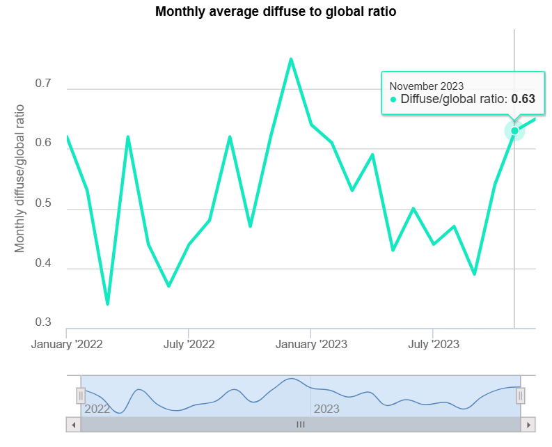
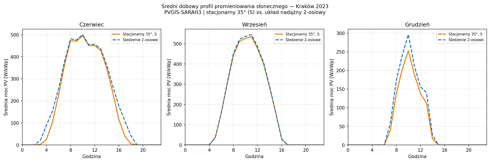

# Sprawozdanie z ćwiczenia nr 4: Czyste energie i ochrona środowiska

**Data wykonania:** 23.04.2026  
**Przedmiot:** Czyste energie i ochrona środowiska 2026  
**Ćwiczenie:** 4 – Portal PVGIS (Photovoltaic Geographical Information System) – źródło wiedzy oraz użyteczne narzędzia z zakresu energetyki słonecznej.  
**Autor:** Jan Rosa

---

## 1. Porównanie baz danych nasłonecznienia dostępnych w PVGIS

> Porównaj (w postaci zestawienia tabelarycznego) dostępne na portalu PVGIS bazy danych o nasłonecznieniu pod względem rejonów geograficznych, które obejmują, źródła danych (pomiary naziemne, satelita), rozmiaru elementarnego obszaru, dla którego te dane wyznaczono, zakresu czasowego dostępności danych oraz preferencji stosowania (wskazania autorów portalu).

### Bazy danych PVGIS (irradiacja – zestawienie)

| Dataset                    | Typ danych           | Obszar geograficzny                              | Rozdzielczość        | Zakres czasowy | Źródło bazowe   | Status / preferencja PVGIS                                     |
| -------------------------- | -------------------- | ------------------------------------------------ | -------------------- | -------------- | --------------- | -------------------------------------------------------------- |
| **PVGIS-SARAH3**           | satelitarne          | Europa, Afryka, Bliski Wschód, części Azji       | ~0.05° (~5 km)       | 2005–2023      | Meteosat CM SAF | **domyślna (tam gdzie dostępna)**       |
| **PVGIS-SARAH2**           | satelitarne          | Europa, Afryka, Azja, Ameryka Płd. (ograniczona) | ~0.05° (~5 km)       | 2005–2020      | Meteosat CM SAF | zastępowana przez SARAH3                |
| **PVGIS-NSRDB**            | satelitarno-modelowe | Ameryka Północna i Południowa                    | ~0.038–0.04° (~4 km) | 2005–2015      | NREL NSRDB      | preferowana dla Ameryk                  |
| **PVGIS-ERA5 / ERA5-Land** | reanaliza            | globalny zasięg                                  | ~0.25° (~25 km)      | 2005–2023      | ECMWF ERA5      | fallback (brak satelitów)               |
| **PVGIS-SARAH (legacy)**   | satelitarne          | Europa, Afryka                                   | ~0.05°               | 2005–2016      | CM SAF          | wycofana                                                       |

### Hierarchia użycia danych

PVGIS stosuje następującą kolejność wyboru danych:

1. **SARAH3** → Europa / Afryka / część Azji
2. **NSRDB** → Ameryki
3. **ERA5** → globalny fallback (obszary bez satelitów)

Zgodnie z JRC:

* dane **satelitarne mają pierwszeństwo**
* ERA5 jest używany tylko tam, gdzie brak pokrycia satelitarnego

### Charakterystyka metodologiczna

* **SARAH / NSRDB** — dane satelitarne; rozdzielczość ~5 km i ~4 km
* **ERA5** — reanaliza modelu atmosferycznego ECMWF; rozdzielczość ~25 km (5× gorsza od SARAH)

### Źródło:

[https://joint-research-centre.ec.europa.eu/photovoltaic-geographical-information-system-pvgis/pvgis-releases/pvgis-53_en](https://joint-research-centre.ec.europa.eu/photovoltaic-geographical-information-system-pvgis/pvgis-releases/pvgis-53_en)

---

## 2. Miesięczne nasłonecznienie dla miejsca zamieszkania

> Pobierz w formie raportów pdf dane o miesięcznym nasłonecznieniu dla miejsca Twojego zamieszkania i w uproszczonej formie (np. wykresy) zamieść ich najistotniejsze fragmenty w sprawozdaniu. Najlepiej do tego celu wykorzystać plik TMY.

Analiza parametrów radiacyjnych dla lokalizacji miejsca zamieszkania (Prądnik Czerwony, Kraków) przeprowadzona w oparciu o bazę **PVGIS-SARAH3** (rok 2022).

### Miesięczne sumy promieniowania — Kraków 2022

| Miesiąc | H(h) [kWh/m²] | H(i_opt) [kWh/m²] | H(i=40°) [kWh/m²] | Gb(n) [kWh/m²] | Kd [-] |
|---------|:-------------:|:-----------------:|:-----------------:|:--------------:|:------:|
| Sty | 26,6 | 50,4 | 50,8 | 42,6 | 0,63 |
| Lut | 49,8 | 81,4 | 81,8 | 70,0 | 0,53 |
| Mar | 115,7 | 168,7 | 169,2 | 161,1 | 0,34 |
| Kwi | 105,4 | 114,1 | 113,9 | 75,9 | 0,61 |
| Maj | 176,3 | 179,8 | 179,3 | 158,1 | 0,44 |
| Cze | 189,0 | 185,3 | 184,6 | 177,6 | 0,37 |
| Lip | 173,2 | 173,0 | 172,4 | 147,2 | 0,44 |
| Sie | 144,8 | 157,1 | 156,8 | 124,5 | 0,48 |
| Wrz | 91,5 | 107,2 | 107,2 | 70,4 | 0,60 |
| Paź | 74,6 | 120,6 | 121,2 | 107,2 | 0,45 |
| Lis | 31,2 | 52,6 | 52,8 | 40,4 | 0,62 |
| Gru | 19,2 | 33,5 | 33,7 | 24,5 | 0,73 |
| **Rok** | **1197,4** | **1423,7** | **1423,5** | **1199,4** | — |

*H(h) — irradiancja horyzontalna; H(i_opt) — irradiancja pod kątem optymalnym (38°); H(i=40°) — irradiancja pod wybranym kątem; Gb(n) — promieniowanie bezpośrednie normalne; Kd — wskaźnik rozproszenia. Źródło: PVGIS-SARAH3.*

### Analiza insolacji i kątów nachylenia

  * **Ekstrema:** Maksymalna irradiancja horyzontalna H(h) wyniosła w czerwcu 2022 (**189,0 kWh/m²**), minimalna w grudniu 2022 — **19,2 kWh/m²**.
  * **Optymalizacja:** Średnioroczny kąt nachylenia płaszczyzny odbiorczej wynosi **38°**, wybrany kąt to **40°** (zaokrąglenie do pełnej dziesiątki, które nieznacznie przesuwa optimum w kierunku okresu zimowego, gdy kąt elewacji Słońca jest niski). Zastosowanie nachylenia optymalnego w stosunku do poziomego zwiększa uzysk w styczniu o ok. **89%**.

$ oraz $H(i\_opt)$.")

### Składowe promieniowania i warunki atmosferyczne

  * **Wskaźnik rozproszenia ($K_d$):** W okresie zimowym dominuje promieniowanie rozproszone ($K_d > 0,6$). Najwyższą klarowność atmosfery odnotowano w marcu 2022 ($K_d = 0,34$).
  * **Wpływ horyzontu:** Symulacja uwzględnia model wysokościowy terenu (DEM), ograniczający dostęp do bezpośredniego promieniowania przy niskich kątach elewacji Słońca (szczególnie w kwartale zimowym).
  * **Termika:** Średnie temperatury dobowe w szczycie insolacji (czerwiec-sierpień) wynoszą **17–20°C**; temperatura ogniwa przy nasłonecznieniu 1000 W/m² wynosi ok. 40–45°C, co przy typowym współczynniku temperaturowym −0,40%/°C (krzemowe moduły polikrystaliczne) daje straty sprawności rzędu **6–8%** względem STC.



.")

---

## 3. Wybór optymalnej bazy pogodowej dla warunków Polski

> Na podstawie informacji umieszczonych na portalu zasugeruj, która baza pogodowa w przypadku naszego kraju będzie najbardziej odpowiednia do przeprowadzenia symulacji pracy systemów fotowoltaicznych.

Dla warunków Polski najbardziej odpowiednią bazą danych w PVGIS jest **PVGIS-SARAH3**.

PVGIS-SARAH3 obejmuje Europę (domyślna baza w regionie), dostarcza dane satelitarne o rozdzielczości ~5 km (vs ~25 km dla ERA5) i obejmuje okres 2005–2023 (vs 2005–2020 dla SARAH2). Roczna suma GHI dla Krakowa z SARAH3 wynosi 1140,7 kWh/m² (rok 2023).

---

## 4. Analiza dziennej dostępności promieniowania słonecznego dla różnych układów pracy

> Dla swojego miejsca zamieszkania, wykorzystując bazę danych pogodowych wskazaną w pkt.3 przeanalizuj dzienną dostępność promieniowania słonecznego na płaszczyźnie skierowanej na południe i pochylonej pod kątem 35° oraz na płaszczyźnie śledzącej pozycję Słońca. W sprawozdaniu umieść odpowiednie wykresy dla następujących miesięcy: czerwiec, wrzesień i grudzień.

Analiza oparta na godzinowych danych PVGIS-SARAH3 dla roku 2023. Porównano dwa układy: **stacjonarny** (nachylenie 35°, azymut 0° — południe) oraz **nadążny 2-osiowy** (śledzenie zarówno azymutu, jak i elewacji Słońca).



| Miesiąc | H(35°) [kWh/d] | H(2-oś) [kWh/d] | Zysk śledzenia |
|---------|:--------------:|:---------------:|:--------------:|
| Czerwiec | 4,23 | 4,66 | +10,0% |
| Wrzesień | 3,86 | 3,94 | +1,9% |
| Grudzień | 1,09 | 1,30 | +19,6% |

Czerwiec: długi dzień słoneczny, Słońce wysoko (elewacja ~63° w południe) — profil szeroki, płaski. Zysk z śledzenia pochodzi głównie z godzin porannych i wieczornych, gdy Słońce jest nisko i panel stacjonarny jest źle ustawiony do azymutu. Wrzesień: krótszy dzień, Słońce niżej — profil węższy. Zysk z śledzenia minimalny, ponieważ dzień jest już krótszy i kąt elewacji w południe (~37°) jest bliski kątowi nachylenia panelu. Grudzień: bardzo krótki dzień (ok. 8 h), elewacja ~17° w południe — profil wąski. Zysk 2-osiowego śledzenia (+19,6%) jest tu największy, bo panel stacjonarny 35° jest słabo skierowany do nisko stojącego Słońca.

---

## 5. Wpływ zachmurzenia na promieniowanie w okolicach południa słonecznego

> Na podstawie analizy z pkt 4 określ w procentach ile całkowitego promieniowania słonecznego pochłaniają chmury w okolicach południa słonecznego (wtedy gdy wartość promieniowania słonecznego jest największa). Porównania dokonaj dla trzech wymienionych wyżej miesięcy.

Analiza oparta na wskaźniku rozproszenia Kd = Gd(i)/G(i) wyznaczonym dla godzin 11:00–13:00 (okolice południa słonecznego) w danych godzinowych PVGIS-SARAH3 2023. Szacunkowy udział pochłoniętego promieniowania obliczono jako: (Kd − 0,15) / 0,85 × 100%, gdzie 0,15 jest typową wartością Kd przy bezchmurnym niebie.

| Miesiąc | G(35°) południe [W/m²] | Kd | Pochłoniête przez chmury [%] |
|---------|:---------------------:|:--:|:---------------------------:|
| Czerwiec | 575 | 0,615 | ~54,7% |
| Wrzesień | 612 | 0,459 | ~36,3% |
| Grudzień | 178 | 0,718 | ~66,9% |

Grudzień charakteryzuje się najsilniejszym wpływem zachmurzenia — chmury pochłaniają ok. 67% potencjalnego promieniowania w okolicach południa. Czerwiec wykazuje umiarkowane zachmurzenie (Kd ≈ 0,62). Wrzesień jest miesiącem o najczystszej atmosferze (Kd ≈ 0,46), chmury pochłaniają ok. 36% promieniowania.

---

## 6. Efektywność śledzenia pozycji Słońca względem układu stacjonarnego

> Na podstawie analizy z pkt 4 określ w jakich miesiącach w okolicy południa słonecznego zastosowanie śledzenia pozycji Słońca najbardziej zwiększa ilość dostępnego promieniowania słonecznego względem stacjonarnego układu pochylonego pod całorocznym kątem optymalnym (35°)?

| Miesiąc | Zysk układu 2-osiowego vs 35° w okolicach południa |
|---------|:--------------------------------------------------:|
| Czerwiec | +1,4% |
| Wrzesień | +1,9% |
| Grudzień | +22,0% |

W okolicach południa słonecznego zysk z śledzenia jest **największy w grudniu** (+22%). Wynika to z niskiej elewacji Słońca (~17°): kąt padania promieniowania na panel stacjonarny 35° wynosi w grudniu w południe |50,06° + 23,45° − 35°| ≈ **38°**, podczas gdy układ 2-osiowy utrzymuje kąt padania 0°. Latem (czerwiec) Słońce jest wysoko (~63°), a panel 35° jest do niego dobrze ustawiony — zysk w południe wynosi zaledwie 1,4%. Wniosek: śledzenie pozycji Słońca przynosi największy zysk **w południe zimą**, gdy elewacja Słońca jest niska i odbiega od kąta nachylenia panelu stacjonarnego. W skali całego dnia zysk latem jest wyższy dzięki godzinom porannym i wieczornym.

---

## 7. Analiza godzinowych danych promieniowania słonecznego

> Dla swojego miejsca zamieszkania, dla bazy danych wybranej w pkt 3 zaimportuj godzinowy plik (w formacie csv) promieniowania słonecznego wraz z jego składowymi w płaszczyźnie horyzontalnej dla ostatniego roku, który jest dostępny w tej bazie. Fragment pliku wraz z nagłówkami kolumn umieść w sprawozdaniu.

Pobrano plik CSV z godzinowymi danymi promieniowania dla Krakowa (PVGIS-SARAH3, rok 2023, płaszczyzna pozioma). Plik zawiera 8 760 rekordów godzinowych. Suma roczna GHI = **1140,7 kWh/m²**.

 oraz średnie dobowe profile GHI dla wybranych miesięcy — Kraków 2023.")

| Kolumna | Opis |
|---------|------|
| `time` | Czas UTC (format YYYYMMDD:HHmm) |
| `Gb(i)` | Promieniowanie bezpośrednie na płaszczyźnie poziomej [W/m²] |
| `Gd(i)` | Promieniowanie rozproszone poziome DHI [W/m²] |
| `Gr(i)` | Promieniowanie odbite od podłoża [W/m²] (≈ 0 dla kąta 0°) |
| `H_sun` | Wysokość Słońca nad horyzontem [°] |
| `T2m` | Temperatura powietrza na wys. 2 m [°C] |
| `WS10m` | Prędkość wiatru na wys. 10 m [m/s] |
| `Int` | Flaga rekonstrukcji (1 = dane interpolowane) |

---

## 8. Charakterystyka sposobów śledzenia Słońca (Vertical axis, Inclined axis, Two axis)

> Własnymi słowami opisz na czym polegają następujące sposoby śledzenia Słońca i jakie parametry należy w nich ustawić: Vertical axis, Inclined axis, Two axis?

### Vertical axis (śledzenie azymutu — oś pionowa)

Panel fotowoltaiczny obraca się wokół **pionowej osi** — śledzi zmianę azymutu Słońca w ciągu dnia (ruch wschód → południe → zachód). Kąt nachylenia panelu względem poziomu jest **stały**. System dobrze sprawdza się latem, gdy Słońce jest wysoko i przesuwa się po szerokim łuku. Zimą, przy niskim Słońcu, efektywność spada.

**Parametry do ustawienia w PVGIS:** kąt nachylenia panelu (Slope [°]) — portal może dobrać go automatycznie jako wartość optymalną dla danej lokalizacji.

### Inclined axis (śledzenie elewacji — oś pochylona)

Panel obraca się wokół **osi pochylonej** (ukierunkowanej N–S i nachylonej pod pewnym kątem od poziomu). Śledzenie odbywa się głównie w płaszczyźnie zawierającej ruch Słońca przez południk — panel podąża za zmianą wysokości Słońca nad horyzontem w ciągu roku. Jest to kompromis między prostotą układu a zyskiem energetycznym i na szerokości Polski daje największy roczny przyrost produkcji spośród trzech opisanych systemów.

**Parametry do ustawienia w PVGIS:** kąt nachylenia osi obrotu (Slope of the rotation axis [°]) — portal może dobrać go automatycznie.

### Two axis (śledzenie pełne — dwie osie)

Panel obraca się jednocześnie wokół **dwóch osi**: pionowej (azymut) i poziomej (elewacja). Zawsze jest ustawiony prostopadle do promieni słonecznych, co zapewnia maksymalne możliwe pochłanianie promieniowania bezpośredniego przez cały dzień i przez cały rok. Jest to technicznie najdokładniejszy układ, ale też najbardziej skomplikowany mechanicznie.

**Parametry do ustawienia w PVGIS:** brak dodatkowych parametrów kątowych — obie osie są sterowane automatycznie tak, aby panel stale wskazywał Słońce.

*Źródło: PVGIS User Manual v5.3; Dąbrowski et al., Energies 2025, 18(10), 2553 — [doi:10.3390/en18102553](https://www.mdpi.com/1996-1073/18/10/2553)*

---

## 9. Metodyka tworzenia plików TMY (Typical Meteorological Year)

> Wyjaśnij jak tworzone są pliki TMY?

TMY (Typowy Rok Meteorologiczny) to **syntetyczny plik godzinowy** sklejony z 12 miesięcy, z których każdy pochodzi z innego roku historycznego. Nie odpowiada żadnemu rzeczywistemu rokowi — reprezentuje przeciętne warunki meteorologiczne dla danej lokalizacji. Dla PVGIS-SARAH3 podstawą jest 19 lat danych (2005–2023).

Procedura opiera się na **metodzie Finkelstein-Schafer**: dla każdego z 12 miesięcy kalendarzowych PVGIS porównuje dystrybuantę (CDF) wybranych zmiennych (GHI, DNI, temperatura) z każdego dostępnego roku z dystrybuantą długookresową. Miesiąc, którego statystyka FS jest najmniejsza — czyli najbardziej zbliżony do wieloletniej normy — zostaje wybrany jako reprezentatywny. Wybrane 12 miesięcy sklejane są w plik 8 760 rekordów godzinowych, gotowy do użycia jako dane wejściowe symulacji systemów PV.

*Źródło: Huld T. et al., Solar Energy 2012; PVGIS User Manual v5.3.*

---

## 10. Zawartość i rozdzielczość czasowa plików TMY w PVGIS

> Wymień dane umieszczone w plikach TMY na portalu PVGIS oraz określ rozdzielczość czasową tych plików (jaki zakres czasu przypisany jest pojedynczemu rekordowi).

**Rozdzielczość czasowa:** 1 godzina — każdy rekord odpowiada jednej godzinie. Plik zawiera 8 760 rekordów (365 dni × 24 h).

Plik TMY w PVGIS zawiera nagłówek metadanych (współrzędne, wysokość, przesunięcie czasu nasłonecznienia) oraz tabelę informującą, z którego roku pochodzi każdy miesiąc. Po nagłówku następują dane godzinowe w kolumnach:

| Kolumna | Opis | Jednostka |
|---------|------|-----------|
| `time(UTC)` | Czas w strefie UTC (format YYYYMMDD:HHmm) | — |
| `T2m` | Temperatura powietrza na wys. 2 m | °C |
| `RH` | Wilgotność względna | % |
| `G(h)` | Globalne promieniowanie poziome GHI | W/m² |
| `Gb(n)` | Promieniowanie bezpośrednie normalne DNI | W/m² |
| `Gd(h)` | Promieniowanie rozproszone poziome DHI | W/m² |
| `IR(h)` | Promieniowanie długofalowe (podczerwone) poziome | W/m² |
| `WS10m` | Prędkość wiatru na wys. 10 m | m/s |
| `WD10m` | Kierunek wiatru | ° |
| `SP` | Ciśnienie atmosferyczne przy powierzchni | Pa |

---

## 11. Analiza formatów plików TMY dla wybranej lokalizacji

> Pobierz z portalu PVGIS oba pliki TMY właściwe dla Twojego miejsca zamieszkania. Pliki pobierz we wszystkich możliwych formatach a następnie je oglądnij. Początku fragment dowolnego z tych plików (z nagłówkami kolumn) umieść w sprawozdaniu.

Pobrano pliki TMY dla Krakowa (PVGIS-SARAH3, 2005–2023) w formatach: **CSV**, **JSON**, **EPW** (EnergyPlus Weather) oraz **basic CSV**.

 oraz mapa ciepła średniego godzinowego GHI w cyklu dobowo-rocznym (prawy panel).")

Tabela miesięcy i lat źródłowych z nagłówka pliku TMY CSV:

| Miesiąc | Rok źródłowy |
|---------|:------------:|
| Styczeń | 2005 |
| Luty | 2014 |
| Marzec | 2010 |
| Kwiecień | 2006 |
| Maj | 2010 |
| Czerwiec | 2021 |
| Lipiec | 2022 |
| Sierpień | 2020 |
| Wrzesień | 2014 |
| Październik | 2008 |
| Listopad | 2020 |
| Grudzień | 2008 |

Format EPW jest przeznaczony dla programów symulacji budynkowych (EnergyPlus, OpenStudio), natomiast CSV i JSON służą jako dane wejściowe dla narzędzi symulacji PV.

---

## 12. Produkcja energii przez system o mocy 1 kWp: montaż wolnostojący vs BIPV

> W miejscu swojego zamieszkania zlokalizuj stacjonarny system fotowoltaiczny o mocy 1 kWp ustawiony pod optymalnymi kątami azymutu i elewacji (wyliczenia dokonane przez portal). Korzystając z bazy PVGIS-SARAH3 sprawdź jaką ilość energii będzie on rocznie produkował w przypadku montażu wolnostojącego a jaką w przypadku integracji z budynkiem. Wartości końcowe przedstaw w sprawozdaniu określając procentowy spadek produkcji dla systemu zintegrowanego z budynkiem. Spróbuj wyjaśnić co jest przyczyną tego spadku produkcji energii elektrycznej?

Lokalizacja: Kraków (50,062°N, 19,937°E) | Baza: PVGIS-SARAH3 | Moc: 1 kWp | Straty systemowe: 14%

| Wariant montażu | Kąt nachylenia | Azymut | E_y [kWh/kWp] |
|-----------------|:--------------:|:------:|:-------------:|
| Wolnostojący (optymalny) | 39° | −1° | **1085,0** |
| BIPV (fasada południowa) | 90° | 0° | **775,5** |
| **Spadek produkcji BIPV** | | | **−28,5%** |

| Miesiąc | Wolnostojący [kWh] | BIPV 90° [kWh] | Różnica [%] |
|---------|:-----------------:|:---------------:|:-----------:|
| Sty | 44,6 | 47,2 | **−5,7%** |
| Lut | 57,8 | 54,0 | +6,6% |
| Mar | 97,0 | 78,2 | +19,4% |
| Kwi | 115,4 | 76,4 | +33,8% |
| Maj | 121,6 | 67,7 | +44,3% |
| Cze | 124,7 | 63,9 | +48,8% |
| Lip | 129,9 | 68,7 | +47,1% |
| Sie | 123,0 | 75,9 | +38,3% |
| Wrz | 103,0 | 77,9 | +24,4% |
| Paź | 81,8 | 74,6 | +8,9% |
| Lis | 46,6 | 47,3 | **−1,5%** |
| Gru | 39,6 | 43,7 | **−10,3%** |

**Przyczyna spadku produkcji BIPV:** Pionowe zamontowanie modułów (90°) powoduje, że promieniowanie bezpośrednie pada pod dużym kątem padania przez większą część roku — szczególnie latem, gdy Słońce jest wysoko nad horyzontem (elewacja ~63° w czerwcu). Dla pionowej fasady kąt padania wynosi wtedy ~63°, co daje współczynnik cos(63°) ≈ 0,45 — panel pochłania mniej niż połowę potencjalnego promieniowania bezpośredniego. Wyjątek stanowią miesiące zimowe (grudzień, styczeń), gdy Słońce jest nisko (~17°) i fasada pionowa jest do niego stosunkowo dobrze ustawiona — BIPV produkuje wtedy więcej niż system wolnostojący pod kątem 39°.

---

## 13. Przygotowanie pliku obrysu horyzontu (Horizon File)

> Korzystając z informacji zawartych na portalu stwórz plik obrysu horyzontu taki aby idąc od kierunku północnego (przez wschodni) do południowego horyzont miał wysokość 10°, a idąc dalej od kierunku południowego (przez zachodni) do północnego horyzont miał 20° wysokości.

Plik horyzontu zawiera 36 wierszy (co 10° azymutu, od 0° do 350°). Format: `azymut,wysokość_horyzontu`.

```
0,10
10,10
20,10
...
170,10
180,20
190,20
...
350,20
```

Horyzont 10° od strony północnej (0°–170°) symuluje niewysoką zabudowę lub drzewa po wschodniej stronie. Horyzont 20° od strony południowej (180°–350°) symuluje wyższą przeszkodę (budynek, wzniesienie) blokującą promieniowanie bezpośrednie przy niskich kątach elewacji Słońca — co ma szczególne znaczenie zimą. Plik zapisano jako `horizon_ugorek44.csv`.

---

## 14. Symulacja pracy systemu z uwzględnieniem zdefiniowanego horyzontu

> Wygenerowany plik wczytaj do na portal i użyj w symulacji pracy wolnostojącego systemu PV o mocy 1 kWp ustawionego pod optymalnymi kątami azymutu i elewacji (kąty muszą być na nowo obliczone przez portal po wczytaniu pliku obrysu horyzontu). Otrzymane wyniki (energia i nowe kąty) opisz w sprawozdaniu i porównaj z wynikami osiągniętymi w pkt.12.

Lokalizacja: Ugorek 44, Kraków (50,079°N, 19,984°E) | Baza: PVGIS-SARAH3 | Moc: 1 kWp

| Parametr | Bez horyzontu (ref. pkt. 12) | Z horyzontem niestandardowym |
|----------|:---------------------------:|:----------------------------:|
| Kąt optymalny | 39° | **35°** |
| Azymut optymalny | −1° | **−12°** |
| E_y [kWh/kWp] | 1081,2 | **1011,2** |
| Zmiana roczna | — | **−6,5%** |

| Miesiąc | Bez horyzontu [kWh] | Z horyzontem [kWh] | Zmiana [%] |
|---------|:-------------------:|:------------------:|:----------:|
| Sty | 44,2 | 26,3 | −40,6% |
| Lut | 57,3 | 48,6 | −15,1% |
| Mar | 95,9 | 91,1 | −5,1% |
| Kwi | 114,8 | 114,2 | −0,6% |
| Maj | 121,2 | 122,7 | +1,2% |
| Cze | 124,7 | 127,0 | +1,9% |
| Lip | 130,0 | 131,9 | +1,4% |
| Sie | 123,6 | 124,1 | +0,4% |
| Wrz | 102,9 | 99,2 | −3,6% |
| Paź | 81,1 | 71,9 | −11,3% |
| Lis | 46,5 | 33,4 | −28,3% |
| Gru | 39,0 | 20,9 | −46,3% |

**Analiza:** Horyzont 20° od strony południowej drastycznie redukuje produkcję zimową — w grudniu o **−46,3%**, w styczniu o **−40,6%**. Słońce w Polsce zimą wschodzi i zachodzi nisko (elewacja <20°), a przeszkoda o wysokości 20° zasłania je przez znaczną część krótkiego dnia. PVGIS zareagował zmianą optymalnych kątów: nachylenie zmniejszyło się z 39° do **35°** (mniejszy kąt oznacza lepsze wychwytywanie promieniowania od przodu horyzontu), a azymut przesunął się z −1° na **−12°** (panel obrócony lekko na wschód, bo zachodnia część horyzontu jest bardziej zablokowana). Latem (maj–sierpień) wpływ horyzontu jest pomijalny lub nieznacznie pozytywny, gdyż Słońce jest wtedy wysoko ponad przeszkodami.

---

## 15. Porównanie wariantów systemów nadążnych o mocy 1 kWp

> W miejscu swojego zamieszkania zlokalizuj nadążny system fotowoltaiczny o mocy 1 kWp. Korzystając z bazy PVGIS-SARAH3 sprawdź jaką ilość energii będzie on rocznie produkował w każdym z trzech dostępnych na portalu PVGIS wariantów śledzenia pozycji Słońca. Tam gdzie to możliwe pozwól portalowi w sposób automatyczny dobrać parametry śledzenia. Pamiętaj aby analiza odbywała się dla obrysu horyzontu wynikającego z ukształtowania terenu („Calculated horizon") a nie dla własnego pliku obrysu horyzontu. Przeanalizuj wyniki porównując je z wynikami wolnostojącego systemu PV ustawionego pod optymalnymi kątami (pkt. 12). Wyniki analizy i porównania umieść w sprawozdaniu.

Lokalizacja: Ugorek 44, Kraków (50,079°N, 19,984°E) | Baza: PVGIS-SARAH3 | Horizont: Calculated (teren) | Moc: 1 kWp

| System | E_y [kWh/kWp] | Przyrost vs stacjonarny (pkt. 12) |
|--------|:-------------:|:---------------------------------:|
| Stacjonarny, kąt optymalny (pkt. 12) | **1081,2** | — |
| Vertical axis (śledzenie azymutu) | **1191,2** | +10,2% |
| Inclined axis (śledzenie elewacji) | **1361,2** | +25,9% |
| Two-axis (pełne śledzenie) | **1103,7** | +2,1% |

| Miesiąc | Stacjonarny | Vertical axis | Inclined axis | Two-axis |
|---------|:-----------:|:-------------:|:-------------:|:--------:|
| Sty | 44,2 | 27,0 | 46,6 | 42,6 |
| Lut | 57,3 | 47,6 | 62,5 | 53,7 |
| Mar | 95,9 | 97,4 | 116,5 | 96,2 |
| Kwi | 114,8 | 112,0 | 118,7 | 96,6 |
| Maj | 121,2 | 167,2 | 175,1 | 136,6 |
| Cze | 124,7 | 169,5 | 175,2 | 138,8 |
| Lip | 130,0 | 181,4 | 188,7 | 147,7 |
| Sie | 123,6 | 136,2 | 145,7 | 114,5 |
| Wrz | 102,9 | 130,1 | 151,5 | 117,2 |
| Paź | 81,1 | 68,2 | 89,8 | 77,1 |
| Lis | 46,5 | 31,1 | 47,7 | 42,9 |
| Gru | 39,0 | 23,5 | 43,2 | 39,9 |

**Analiza:**

**Inclined axis** (+25,9%) osiąga największy roczny przyrost. Śledzenie elewacji (kąta wysokości) Słońca przez cały rok opłaca się szczególnie w Polsce, gdzie Słońce wznosi się na bardzo różne wysokości między zimą a latem. Automatycznie dobierany kąt pochylenia osi optymalnie wykorzystuje tę zmienność.

**Vertical axis** (+10,2%) dobrze sprawdza się latem (maj–wrzesień +10–40%), gdy Słońce jest wysoko i szeroko przemieszcza się po niebie. W zimie działa gorzej niż stacjonarny (styczeń −39%, grudzień −40%) — obracając się wokół pionowej osi nie może kompensować niskiej elewacji Słońca, a panel zachowuje stały kąt nachylenia.

**Two-axis** (+2,1%) daje niski roczny zysk pomimo pełnego śledzenia. Przyczyną jest dominacja promieniowania rozproszonego w Polsce (Kd > 0,5 w 8 z 12 miesięcy) — przy rozproszonym promieniowaniu orientacja panelu nie wpływa istotnie na uzysk, a zysk z pełnego śledzenia realizuje się głównie przy promieniowaniu bezpośrednim.

---

## 16. Projekt i analiza pracy wyspowego systemu fotowoltaicznego (Off-grid)

> Zaprojektuj i przeanalizuj pracę wyspowego systemu fotowoltaicznego, który dostarczałby nieprzerwanie przez cały rok energię elektryczną do odbiornika przy następujących założeniach:
>
> a. Lokalizacja: Kraków  
> b. Dane pogodowe: PVGIS SARAH3  
> c. Moc odbiornika: 42 W  
> d. Sposób zasilania: ciągły, stały pobór mocy przez całą dobę (należy przygotować odpowiedni plik profilu zapotrzebowania na moc)  
> e. Wymagana autonomia 7 dni. Należy tak określić pojemność użytkową akumulatora aby był on w stanie zasilać odbiornik przez 7 dób (168 godzin).
>
> W celu zrealizowania tego zadania należy odpowiednio dobrać moc systemu PV oraz kąt pochylenia modułów fotowoltaicznych. Jeżeli uda się zbilansować zapotrzebowanie energetyczne odbiorników w okresie zimowym (grudzień-styczeń) to należy zwrócić uwagę na niewykorzystaną energię w okresie letnim.
>
> Zestawienie wyników projektu wraz z własnym uwagami i przemyśleniami należy umieścić w sprawozdaniu.

### Założenia projektowe

| Parametr | Wartość |
|----------|---------|
| Moc odbiornika | 42 W (ciągły pobór, 24 h/dobę) |
| Zapotrzebowanie dobowe | 1008 Wh/dobę |
| Wymagana autonomia | 7 dni (168 h) |
| Pojemność użytkowa akumulatora | 7056 Wh |
| Poziom odcięcia (cutoff) | 40% |
| Pojemność nominalna akumulatora | **11 760 Wh** |
| Azymut modułów | 0° (południe) |
| Profil zapotrzebowania | jednostajny: 1/24 na każdą godzinę |

### Wyniki przeszukiwania siatki (f_e — % dni z pustym akumulatorem)

| Moc PV [Wp] | 50° | 55° | 60° | 65° | 70° |
|:-----------:|:---:|:---:|:---:|:---:|:---:|
| 500 | 81,3% | 79,1% | 77,4% | 76,1% | 75,4% |
| 750 | 41,3% | 39,6% | 37,9% | 37,4% | 37,5% |
| 1000 | 15,6% | 14,8% | 14,6% | 14,4% | 14,4% |
| 1250 | 5,7% | 5,6% | 5,6% | 5,6% | 5,6% |
| 1500 | 3,0% | 3,0% | 3,0% | 3,0% | 3,2% |
| 1750 | 0,3% | 0,3% | 0,3% | 0,3% | 0,5% |
| **2000** | **0,0% ✓** | **0,0% ✓** | **0,0% ✓** | **0,0% ✓** | **0,0% ✓** |

Kryterium spełnione (f_e = 0%) po raz pierwszy dla **2000 Wp przy kącie 50°**.

### Rekomendacja projektowa

| Parametr | Wartość |
|----------|---------|
| Moc modułów PV | **2000 Wp** |
| Kąt nachylenia | **50°** (ku południu) |
| Pojemność nominalna akumulatora | **11 760 Wh** |
| Pojemność użytkowa | 7056 Wh (autonomia 7 dni) |

### Miesięczny bilans energetyczny

| Miesiąc | Produkcja [Wh/d] | Zapotrzebowanie [Wh/d] | Nadwyżka [Wh/d] | f_e [%] | f_f [%] |
|---------|:----------------:|:----------------------:|:---------------:|:-------:|:-------:|
| Sty | 1008,0 | 1008,0 | 0,0 | 0,0 | 59,4 |
| Lut | 1030,3 | 1008,0 | +22,3 | 0,0 | 80,3 |
| Mar | 1009,6 | 1008,0 | +1,6 | 0,0 | 93,7 |
| Kwi | 1009,0 | 1008,0 | +1,0 | 0,0 | 98,6 |
| Maj | 1008,7 | 1008,0 | +0,7 | 0,0 | 99,0 |
| Cze | 1008,4 | 1008,0 | +0,4 | 0,0 | 100,0 |
| Lip | 1007,6 | 1008,0 | −0,4 | 0,0 | 100,0 |
| Sie | 1006,9 | 1008,0 | −1,1 | 0,0 | 99,7 |
| Wrz | 1006,3 | 1008,0 | −1,7 | 0,0 | 97,4 |
| Paź | 1002,1 | 1008,0 | −5,9 | 0,0 | 85,1 |
| Lis | 995,0 | 1008,0 | −13,0 | 0,0 | 64,0 |
| Gru | 1005,2 | 1008,0 | −2,8 | 0,0 | 49,6 |

*f_e — % dni z pustym akumulatorem; f_f — % dni z pełnym akumulatorem*

### Wnioski i uwagi

**Dobór kąta nachylenia.** Kąt 50° jest wyraźnie stromszy niż optymalny roczny (~38°). Celowo faworyzuje niskie Słońce zimowe — dzięki temu panel zbiera więcej energii w grudniu i styczniu, co pozwala na zmniejszenie wymaganej mocy PV.

**Nadwyżka letnia.** W miesiącach letnich (czerwiec–lipiec) akumulator jest pełny przez 100% dni (f_f = 100%). System 2000 Wp przy nasłonecznieniu letnim produkuje szacunkowo 5000–7000 Wh/d (dla Krakowa czerwiec ~185 kWh/miesiąc na kWp), wobec zapotrzebowania 1008 Wh/d — nadwyżka jest odcinana przez regulator ładowania.

**Granica projektu.** System 1750 Wp nie spełnia kryterium (f_e = 0,3% w najtrudniejszym miesiącu) — odpowiada to ok. 1 dniu w roku z niedoborem. Dopiero 2000 Wp gwarantuje f_e = 0% we wszystkich miesiącach przy 7-dniowej autonomii akumulatora.
